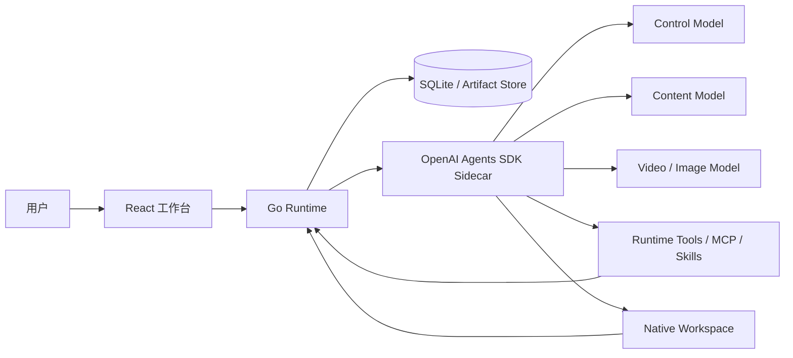

# Arron

Arron 是一个面向小说、剧本和参考视频的内容生产 Agent 平台。它将多轮对话、结构化内容工作流、人工确认、版本管理和长任务恢复整合在同一个项目工作区中。

> 当前仓库是个人开发快照，适合研究、二次开发和本地验证，不应直接视为生产发行版。运行模型任务需要自行配置兼容的模型网关和密钥。

## 核心能力

- 通用 Agent 对话：基于 OpenAI Agents SDK 的 Agent、Runner、Session、Handoff、Function Tool、Guardrail 和流式事件。
- 四类状态化内容工作流：小说转剧本、非小说文本转剧本、剧本续写、视频参考创作。
- 可装载 inline Skill：在当前对话轮中按版本加载指令和资源，并通过原生 Handoff 交给专用 Agent。
- 长任务执行：支持分批生成、暂停、继续、取消、失败项重试、原生 RunState 恢复和人工审批。
- 内容工作区：统一管理来源材料、故事圣经、分集规划、单集剧本、完整剧本和通用文档。
- 版本与追溯：Artifact、Version、Lineage、Revision、Run、Approval 和工具调用均保留确切身份。
- 多模态输入：支持文本、常用文档、图片和视频处理链路。
- 受控执行：Go Runtime 负责权限、幂等、持久状态、运行控制和最终写入校验。

## 系统架构



- **Frontend**：React 19、TypeScript、Vite。负责项目、对话、运行进度、审批、版本历史和产物编辑界面。
- **Go Runtime**：Go 1.24。保存权威业务事实，处理项目、对话消息、Artifact、Run、Approval、权限、事务和幂等。
- **Agent Sidecar**：Python 与 OpenAI Agents SDK。负责模型 Session、意图与目标判断、Skill 路由、工具选择、Handoff 和流式 Runner。
- **Task Worker**：同一 Sidecar 内的状态化执行器。领取 Go Runtime 租约，按冻结 Context Pack 运行内容步骤并提交结构化结果。
- **Capability Registry**：使用版本化 Manifest 描述业务 Skill、步骤图、输入输出、审批点、重试策略和 UI 投影。
- **Native Workspace**：为需要多文件操作的 Agent 提供受控工作树、快照、恢复和显式发布边界。
- **Model Providers**：控制模型负责主 Agent；内容模型负责文本产物；视频/图片模型负责对应多模态任务。

Go Runtime 不代替 Agent 判断用户意图，Sidecar 也不能绕过 Runtime 直接修改权威数据。

## Agent 框架

### 职责边界

| 能力 | 负责组件 | 说明 |
| --- | --- | --- |
| 对话推理、路由和工具选择 | SDK Agent | 根据用户请求和可用能力决定读取什么、是否调用 Skill、是否执行工具 |
| 模型侧历史与工具项 | SDK Session | 保存模型真正看到的消息、工具调用、工具结果和压缩项 |
| 用户可见消息与项目事实 | Go Runtime | 是前端展示、权限判断和审计的权威来源 |
| 业务工作流状态 | Go Runtime | 保存 Run、Step、Task、Attempt、Cursor、Approval 和失败状态 |
| 内容步骤执行 | SDK Task Worker | 按冻结输入、Prompt、Rules、Schema 和确切上游版本生成结果 |
| 文件与代码工作区 | SDK SandboxAgent + Runtime Sandbox | 提供隔离文件树、命令、补丁、快照和恢复；发布仍需 Runtime 确认 |
| 最终写入 | Runtime Command API | 校验身份、版本、权限、幂等键和业务状态后提交 |

该边界的核心原则是：**SDK 负责 Agent 行为，Runtime 负责业务事实和不可绕过的安全约束。**

### 一次主 Agent 请求如何执行

1. 前端把用户消息、项目 ID、会话 ID、引用对象和附件发送给 Go Runtime。
2. Runtime 先持久化用户可见消息，创建带幂等键和调度代次的 Agent Turn。
3. Sidecar 为该项目会话取得 SDK Session，并在首次使用时从完整 Go 对话记录初始化一次。
4. Session 在 Runner 读取历史前执行 SDK 原生 Responses compaction；同一 Session 的完整 Runner 轮次串行执行。
5. 主 Agent 通过只读工具检查项目、目标、素材、Artifact、Run、历史消息和可用 Capability。
6. Agent 可以直接回答、选择 inline Skill Handoff，或通过 Runtime 命令启动状态化业务 Run。
7. 写工具先经过工具目录、访问级别、审批策略、参数 Guardrail 和 Runtime 权限校验。
8. Runner 持续输出模型、工具、用量和状态事件；Go Runtime 将可公开事件投影给前端。
9. 只有 `commit_agent_action` 或对应 Runtime 提交成功后，本轮才算完成；失败、取消、暂停和等待审批分别进入独立终态。
10. 需要恢复时使用已保存的 RunState、工具调用身份、工作区快照和原调度代次，不从用户原始文本盲目重跑。

### Agent 执行形态

| 形态 | 用途 | 生命周期 |
| --- | --- | --- |
| Main Agent | 普通对话、问进度、查产物、启动或控制任务、修改内容 | 一个持久会话中的多轮 Turn |
| Inline Skill Agent | 对单轮请求应用专用指令，例如大纲诊断 | 通过版本固定的 SDK Handoff 在同一 Turn 内完成 |
| Stateful Skill Worker | 执行四类内容生产工作流 | 独立 Run/Step/Task，可跨审批、暂停和进程重启 |
| Bounded Subtask Agent | 并行完成有限分析或草拟工作 | 只读项目数据，最多有限次读取，不能保存或外部写入 |
| SandboxAgent | 多文件、补丁、受控命令和 Skill 制作 | 绑定一个执行身份、租约、工作区和可恢复快照 |

子任务 Agent 继承必要的执行身份用于授权，但使用隔离上下文；它不能修改项目、安装 Skill、管理任务或再次委派。父 Agent 必须检查子任务返回的证据和 Artifact 版本后才能提交结果。

### Session 与上下文压缩

- 每个 `project_id + conversation_id` 对应一个持久 `SQLiteSession`。
- 首次初始化时从 Go Runtime 的完整会话记录导入用户和 Agent 消息，之后模型侧历史由 SDK Session 管理。
- Session 同时保留模型工具项，因此不会把 Worker 的完整生成正文简单拼入主 Agent 对话。
- 使用 `OpenAIResponsesCompactionSession` 在输入阶段执行原生压缩，压缩结果必须包含有效的原生 `compaction` 项和加密内容。
- 网关返回普通文本摘要，即使 HTTP 状态为 200，也会被视为协议不兼容。
- 项目不会回退到“最近 N 条消息”或本地自制摘要，因为那会破坏 SDK Session 的工具上下文和恢复语义。

对应实现见 [`session.py`](experiments/openai-agents-sidecar/src/content_agent_sidecar/session.py)。

### 工具系统

主 Agent 的工具不是一个无约束函数列表，而是由 Runtime 返回的工具目录和当前执行上下文动态组装。

**项目与内容读取**

- `inspect_project`、`inspect_project_goal`
- `list_project_assets`、`inspect_text_asset`
- `search_artifacts`、`inspect_current_artifact`、`inspect_artifact_version`
- `get_artifact_downloads`、`inspect_run`
- `inspect_recent_conversation`、`search_conversation_history`

**Skill 与 Capability**

- `list_capabilities`、`load_skill_instructions`
- `list_skill_resources`、`read_skill_resource`
- `validate_workspace_skill`、`install_workspace_skill`
- `execute_skill_script`，仅对当前已选择、已验证且策略允许的 Skill 开放

**任务与运行控制**

- `list_execution_targets`、`inspect_execution_controls`
- `control_execution`、`set_episode_execution_mode`
- 支持的业务命令由 Capability Manifest 声明，并由 Runtime 再次校验

**工作区与发布**

- `list_workspace_files`、`read_workspace_file`、`apply_workspace_patch`
- Native Workspace 中的 filesystem、`apply_patch`、受控 shell/PTY
- `prepare_workspace_publication` 与 `publish_workspace_files` 将工作树文件显式发布为项目文件

**外部工具**

- 工具目录可以声明 MCP、Hosted Tool 和运行时 Function Tool。
- MCP 支持 stdio、SSE 和 streamable HTTP 传输，但是否可用取决于管理员配置、凭据、白名单和真实环境验收。
- 外部写工具不能因为网络结果未知而自动重放；系统会暂停并要求核对，避免重复副作用。

工具实现入口见 [`runtime.py`](experiments/openai-agents-sidecar/src/content_agent_sidecar/runtime.py) 和 [`agent_tools.py`](experiments/openai-agents-sidecar/src/content_agent_sidecar/agent_tools.py)。

### 审批、恢复与安全

- 工具访问分为只读和写入；写入工具可声明 `approval=always`。
- Input、Output、Tool Input 和 Tool Output 都经过 Guardrail，限制尺寸并阻止配置密钥进入模型产物或工具参数。
- RunState、活动工具调用、Artifact 版本、Context Pack、工作区快照和审批决定均绑定确切执行身份。
- 用户暂停、工具审批、模型失败、结构化输出修复和外部工具结果未知都有不同恢复路径。
- 取消会停止 Runner，并将 Session 恢复到本轮开始前的安全边界；不会把半轮工具历史作为已提交对话。
- 任务租约、续租、超时和调度代次防止旧 Worker 在失去执行权后继续写入。
- 所有最终内容仍需通过 Schema、业务规则和 Runtime 事务检查，模型输出本身不等于成功写入。

Guardrail 实现见 [`guardrails.py`](experiments/openai-agents-sidecar/src/content_agent_sidecar/guardrails.py)。

## Skill 框架

### 两类 Skill

项目中“Skill”有两种执行语义，不能混为一谈：

1. **状态化业务 Skill**：位于 [`capabilities/v1`](capabilities/v1)，用于小说转剧本等长流程。一次调用创建业务 Run，可跨多个步骤、批次、审批和重试。
2. **Inline Skill**：使用 `SKILL.md + resources + scripts` 组成，在当前 Agent Turn 中按版本加载，通过 SDK Handoff 执行；不会仅因 Handoff 自动创建业务 Run。

仓库内的 [`outline-critic`](.agents/skills/outline-critic/SKILL.md) 是一个 inline Skill 示例，用于诊断大纲结构、人物动机、冲突升级和钩子问题。

### Manifest 驱动机制

每个状态化 Skill Manifest 都声明：

| 合同 | 作用 |
| --- | --- |
| `input_binding` / `accepted_asset_kinds` | 输入来源类型及允许的素材格式 |
| `routing` / `entry_policy` | 显式别名、意图示例、自动路由和是否要求用户确认 |
| `required_providers` | 内容模型、视频模型、文档解析器等依赖 |
| `config_schema_refs` | 集数、时长和其他生成配置的结构化合同 |
| `steps` | system、model、batch、shared_workflow、review、aggregate 等步骤图 |
| `input_refs` / `output_refs` | 每一步读取和产生的 Artifact 类型、数量、状态及版本策略 |
| `approval` | 普通确认、转移确认、批量确认或条件质量审核 |
| `default_retry` | 自动尝试、用户重试、断点恢复和可重试错误类型 |
| `state_transition` | 人物状态、关系、事实、未闭合钩子和已回收钩子的连续性更新 |
| `completion` | 何时可认定整条 Skill 完成以及必须存在的最终产物 |

批量步骤默认保留已成功项，只重试失败项。单集剧本按自然集序逐集生成，每集同时产生 `script_unit` 和面向下一集的 `script_handoff`；相邻集通过连续性状态传递事实、人物关系和钩子，不依赖把全部旧正文重复塞入上下文。

## 四个状态化 Skill

### 1. 小说转剧本 `novel_to_script` v1.4.0

**适用输入**：小说正文，支持文本或文档素材。

**目标产物**：逐集 `script_unit`、逐集 `script_handoff` 和聚合后的完整 `scripts`。

执行链：

1. `ingest_source`：固定源文件、顺序和生成配置，用户确认来源材料。
2. `build_source_manifest`：生成确定性的来源清单和分段索引。
3. `build_story_bible`：先做来源分析检查点，再汇总人物、关系、世界规则、事件和声口为故事圣经。
4. `review_volume_fit`：判断原文体量能否支撑目标集数；不足时要求用户确认扩写策略。
5. `split_episodes`：先生成全局分集骨架，再每批最多 5 集确定边界，最终形成 `episode_split`。
6. `build_episode_cards`：每批最多 5 集生成分集卡，记录冲突、推进、钩子和连续性变化。
7. `build_script_contexts`：Runtime 为每一集构建冻结的内部脚本上下文。
8. `generate_script_units`：严格按集号逐集生成正文和交接状态，一次任务只生成 1 集。
9. `review_script_set`：每批最多 5 集并行做质量审查；需要修改时进入 AI 修订、手工编辑或风险确认。
10. `aggregate_scripts`：仅聚合已确认的单集版本，生成完整剧本。

关键设计：来源分析与故事圣经是同一产品步骤中的两个模型阶段；分集采用“全局规划 + 五集边界批次”，单集正文保持顺序执行以维护连续性。

### 2. 非小说文本转剧本 `non_novel_to_script` v1.3.0

**适用输入**：故事大纲、梗概、设定、采访材料等非小说文本。

**目标产物**：素材库、故事种子、整季蓝图、分集卡、逐集剧本和完整剧本。

执行链：

1. `ingest_source`：确认素材和创建配置。
2. `build_source_manifest`：生成来源清单。
3. `build_material_bank`：抽取人物、关系、事件、场景、设定、可用冲突和素材缺口。
4. `review_volume_fit`：检查素材量与目标篇幅是否匹配，不足时确认补全策略。
5. `build_story_seed`：把离散材料组织成具有主角、目标、阻力和核心冲突的故事种子。
6. `build_series_blueprint`：形成全季主线、阶段目标、人物弧和节奏规划。
7. `build_episode_cards`：每批最多 5 集生成分集执行卡。
8. `build_script_contexts`：生成每集所需的确切上下文。
9. `generate_script_units`：逐集顺序生成 `script_unit` 与 `script_handoff`。
10. `review_script_set`：按最多 5 集一批并行质检。
11. `aggregate_scripts`：合并已确认单集为完整剧本。

它与小说链最大的区别是：不假设输入已经具有完整叙事，因此先建立 `material_bank -> story_seed -> series_blueprint`，再进入共用的分集和剧本生成链。

### 3. 剧本续写 `script_continuation` v1.0.0

**适用输入**：已有剧本。

**目标产物**：5 个候选续写方向和按选定方向生成的 `continuation_script`。

执行链：

1. `ingest_source`：确认已有剧本及续写要求。
2. `generate_continuation_options`：分析当前人物、冲突、未回收线索和结尾状态，生成 5 个不同方向；用户必须选择或要求修改。
3. `generate_continuation_script`：基于确切选项和原剧本版本生成完整续写结果，并等待最终确认。

该 Skill 不直接在第一轮生成正文，选择续写方向是不可跳过的转移检查点，防止模型自行决定剧情走向。

### 4. 视频参考创作 `video_reference_creation` v1.2.0

**适用输入**：单个视频、多个视频或视频压缩包。

**目标产物**：逐集还原剧本、参考剧本合集、参考分析、改编方案、原创化 Brief、逐集新剧本和完整新剧本。

执行链：

1. `ingest_source`：确认视频批次、集号、顺序和提取配置。
2. `extract_video_scripts`：按视频顺序逐个处理，每个任务只解析 1 个视频并生成 `video_script_unit`。
3. `aggregate_reference_scripts`：合并全部已确认的逐集还原结果。
4. `analyze_reference_scripts`：分析人物、关系、剧情结构、冲突、节奏、钩子和可迁移机制。
5. `propose_adaptation_options`：给出多个改编路线，用户选择路线并确认新剧配置。
6. `build_adaptation_brief`：固定保留机制、改造范围、原创化边界和新故事约束。
7. `build_story_seed`：在 Brief 约束下生成新故事种子。
8. `build_series_blueprint`：形成新故事的整季蓝图。
9. `build_episode_cards`：每批最多 5 集生成分集卡。
10. `build_script_contexts`：为新剧本构建逐集冻结上下文。
11. `generate_script_units`：逐集生成新剧本及交接状态。
12. `review_script_set`：每批最多 5 集进行质量审核。
13. `aggregate_scripts`：合并为完整新剧本。

视频链将“参考视频还原”和“新故事创作”明确分开。视频解析结果先形成可确认的参考剧本，再经过分析、路线选择和原创化 Brief，之后复用非小说创作链；不是直接把原视频台词替换人物名后输出。

### 共用的质量与连续性机制

- `script_context` 是 Runtime 根据确切上游版本生成的内部上下文，避免主 Agent 自行拼接不受控历史。
- `script_handoff` 只向下一集传递必要的连续性状态，包含新增事实、人物变化、关系变化、打开和回收的钩子。
- 单集生成默认串行，质量审核可按有界批次并行。
- 模型结构化输出先经过 Schema 和响应适配器，再由 Runtime 做业务覆盖、集号、版本和完整性检查。
- 失败批次保留成功结果；用户可只重试失败项，也可在已有结果基础上继续。
- 手工编辑会产生新 Artifact Version，不会静默覆盖模型生成版本；下游影响可检查后再决定是否重生成。

## 目录结构

```text
backend/                         Go Runtime、HTTP API 和持久化
frontend/                        React 工作台
experiments/openai-agents-sidecar/
                                 OpenAI Agents SDK 运行时
capabilities/v1/                 四类 Skill 与能力清单
configs/                         工具和运行配置示例
docs/                            架构、协议、验收与迁移文档
scripts/                         本地启动、停止、测试和发布脚本
acceptance/                      验收夹具与检查入口
novel2script_agent_project/      Novel2Script 独立子项目
```

## 本地运行

### 环境要求

- Windows 10/11 与 PowerShell 7
- Node.js 20+ 与 npm
- Go 1.24+
- Python 3.11 或 3.12
- 可选：FFmpeg/FFprobe，用于本地媒体处理

### 1. 克隆并安装依赖

```powershell
git clone https://github.com/Arron201476/Arron.git
cd Arron

npm --prefix frontend ci

py -3.12 -m venv .tools/openai-agents-sidecar-venv
./.tools/openai-agents-sidecar-venv/Scripts/python.exe -m pip install --upgrade pip
./.tools/openai-agents-sidecar-venv/Scripts/python.exe -m pip install -e "./experiments/openai-agents-sidecar[dev]"
```

本仓库的一键启动脚本使用项目内固定 Go 路径。可以把已安装的 Go SDK 映射到该位置：

```powershell
$goRoot = Split-Path -Parent (Split-Path -Parent (Get-Command go).Source)
New-Item -ItemType Directory -Force .tools/go-sdk | Out-Null
New-Item -ItemType Junction -Path .tools/go-sdk/go -Target $goRoot
```

### 2. 配置模型服务

```powershell
Copy-Item backend/.env.example backend/.env.local
```

至少配置以下项目：

```dotenv
CONTENT_AGENT_CONTROL_MODEL_ENDPOINT=https://api.example.com/v1
CONTENT_AGENT_CONTROL_MODEL_API_KEY=your-api-key
CONTENT_AGENT_CONTROL_MODEL_MODEL=your-model

CONTENT_AGENT_CONTENT_MODEL_ENDPOINT=https://api.example.com/v1
CONTENT_AGENT_CONTENT_MODEL_API_KEY=your-api-key
CONTENT_AGENT_CONTENT_MODEL_MODEL=your-model

CONTENT_AGENT_SIDECAR_INTERNAL_TOKEN=replace-with-a-random-secret
```

控制模型网关必须兼容 `/responses` 和 `/responses/compact`。项目不会使用本地摘要或截断历史来冒充 SDK 原生压缩；缺少该接口时，兼容性检查或真实对话会失败。

视频和图片任务还需要配置 `CONTENT_AGENT_VIDEO_MODEL_*`、`CONTENT_AGENT_IMAGE_MODEL_*` 以及对应媒体工具。完整字段见 [`backend/.env.example`](backend/.env.example)。不要提交 `.env.local` 或真实密钥。

### 3. 启动服务

```powershell
./scripts/start-local-demo.ps1
```

默认地址：

| 服务 | 地址 |
| --- | --- |
| Web 工作台 | `http://127.0.0.1:8860` |
| Go Runtime | `http://127.0.0.1:8850` |
| Agents SDK Sidecar | `http://127.0.0.1:8871` |

停止本地服务：

```powershell
./scripts/stop-local-demo.ps1
```

启动失败时查看 `logs/sidecar-demo.err.log`、`logs/backend-demo.err.log` 和 `logs/frontend-demo.err.log`。

## 验证与测试

```powershell
# 前端
npm --prefix frontend test
npm --prefix frontend run build

# Sidecar
./.tools/openai-agents-sidecar-venv/Scripts/python.exe -m pytest experiments/openai-agents-sidecar/tests

# Go Runtime
Push-Location backend
go test ./...
go vet ./...
Pop-Location

# 本地 Agent 平台门禁
./scripts/run-agent-platform-local-gate.ps1
```

部分企业 Windows 环境会通过 Application Control 阻止新编译的 Go 测试程序执行。此时 `go build` 成功只能证明可编译，不能替代 `go test` 的行为验证。

## 数据与安全

- 本地数据库、日志、导出文件、构建缓存和密钥文件已由 `.gitignore` 排除。
- Agent 工具只能通过经过认证的 Runtime API 写入数据。
- 用户上传代码默认不能直接在宿主机执行；脚本能力需要显式配置受控 OCI 沙箱。
- 生产部署前必须重新完成身份、权限、网关、媒体工具、备份恢复和真实端到端验收。

## 开发状态

仓库包含大量阶段性设计、审计和验收记录。单项测试通过不代表所有模型、媒体、浏览器和部署环境均已验收。当前能力边界请以源码、[`docs/agent-platform-goal-progress.md`](docs/agent-platform-goal-progress.md) 和最新实测结果共同判断。

## License

当前仓库尚未附加开源许可证。在许可证补充前，请勿假定代码可被任意复制、分发或商用。
