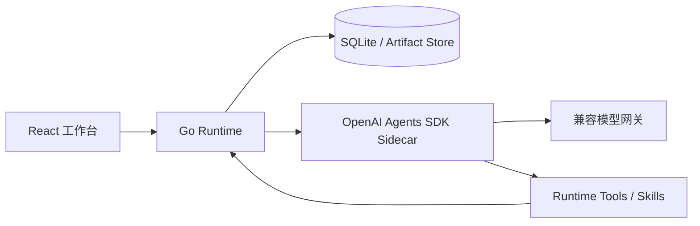

# Arron

Arron 是一个面向小说、剧本和参考视频的内容生产 Agent 平台。它将多轮对话、结构化内容工作流、人工确认、版本管理和长任务恢复整合在同一个项目工作区中。

> 当前仓库是个人开发快照，适合研究、二次开发和本地验证，不应直接视为生产发行版。运行模型任务需要自行配置兼容的模型网关和密钥。

## 核心能力

- 通用 Agent 对话：基于 OpenAI Agents SDK 的 Runner、Session、工具调用和流式事件。
- 四类内容 Skill：小说转剧本、非小说文本转剧本、剧本续写、视频参考创作。
- 状态化工作流：支持批量分集、暂停、继续、取消、重试、失败恢复和人工审批。
- 内容工作区：统一管理来源材料、故事圣经、分集规划、单集剧本和完整剧本。
- 版本与追溯：Artifact 版本、修改记录、依赖关系、生成来源和审批记录可追踪。
- 多模态输入：支持文本、常用文档、图片及视频处理链路。
- 受控执行：Go Runtime 负责权限、幂等、持久状态、运行控制和最终写入校验。

## 系统架构



- **Frontend**：React 19、TypeScript、Vite，提供项目、对话、运行进度、审批和产物编辑界面。
- **Runtime**：Go 1.24，保存权威业务状态并处理项目、Run、Artifact、权限和幂等事务。
- **Agent Sidecar**：Python 与 OpenAI Agents SDK，负责模型会话、Agent 编排、Skill 选择和工具调用。
- **Capability Registry**：使用版本化 Manifest 描述 Skill、工作流、输入输出及 UI 投影。

Go Runtime 不代替 Agent 判断用户意图，Sidecar 也不能绕过 Runtime 直接修改权威数据。

## 目录结构

```text
backend/                         Go Runtime、HTTP API 和持久化
frontend/                        React 工作台
experiments/openai-agents-sidecar/
                                 OpenAI Agents SDK 运行时
capabilities/v1/                 四类 Skill 与能力清单
configs/                         工具和运行配置示例
docs/                            架构、协议、验收与迁移文档
scripts/                         本地启动、停止、测试和发布脚本
acceptance/                      验收夹具与检查入口
novel2script_agent_project/      Novel2Script 独立子项目
```

## 本地运行

### 环境要求

- Windows 10/11 与 PowerShell 7
- Node.js 20+ 与 npm
- Go 1.24+
- Python 3.11 或 3.12
- 可选：FFmpeg/FFprobe，用于本地媒体处理

### 1. 克隆并安装依赖

```powershell
git clone https://github.com/Arron201476/Arron.git
cd Arron

npm --prefix frontend ci

py -3.12 -m venv .tools/openai-agents-sidecar-venv
./.tools/openai-agents-sidecar-venv/Scripts/python.exe -m pip install --upgrade pip
./.tools/openai-agents-sidecar-venv/Scripts/python.exe -m pip install -e "./experiments/openai-agents-sidecar[dev]"
```

本仓库的一键启动脚本使用项目内固定 Go 路径。可以把已安装的 Go SDK 映射到该位置：

```powershell
$goRoot = Split-Path -Parent (Split-Path -Parent (Get-Command go).Source)
New-Item -ItemType Directory -Force .tools/go-sdk | Out-Null
New-Item -ItemType Junction -Path .tools/go-sdk/go -Target $goRoot
```

### 2. 配置模型服务

```powershell
Copy-Item backend/.env.example backend/.env.local
```

至少配置以下项目：

```dotenv
CONTENT_AGENT_CONTROL_MODEL_ENDPOINT=https://api.example.com/v1
CONTENT_AGENT_CONTROL_MODEL_API_KEY=your-api-key
CONTENT_AGENT_CONTROL_MODEL_MODEL=your-model

CONTENT_AGENT_CONTENT_MODEL_ENDPOINT=https://api.example.com/v1
CONTENT_AGENT_CONTENT_MODEL_API_KEY=your-api-key
CONTENT_AGENT_CONTENT_MODEL_MODEL=your-model

CONTENT_AGENT_SIDECAR_INTERNAL_TOKEN=replace-with-a-random-secret
```

控制模型网关必须兼容 `/responses` 和 `/responses/compact`。项目不会使用本地摘要或截断历史来冒充 SDK 原生压缩；缺少该接口时，兼容性检查或真实对话会失败。

视频和图片任务还需要配置 `CONTENT_AGENT_VIDEO_MODEL_*`、`CONTENT_AGENT_IMAGE_MODEL_*` 以及对应媒体工具。完整字段见 [`backend/.env.example`](backend/.env.example)。不要提交 `.env.local` 或真实密钥。

### 3. 启动服务

```powershell
./scripts/start-local-demo.ps1
```

默认地址：

| 服务 | 地址 |
| --- | --- |
| Web 工作台 | `http://127.0.0.1:8860` |
| Go Runtime | `http://127.0.0.1:8850` |
| Agents SDK Sidecar | `http://127.0.0.1:8871` |

停止本地服务：

```powershell
./scripts/stop-local-demo.ps1
```

启动失败时查看 `logs/sidecar-demo.err.log`、`logs/backend-demo.err.log` 和 `logs/frontend-demo.err.log`。

## 验证与测试

```powershell
# 前端
npm --prefix frontend test
npm --prefix frontend run build

# Sidecar
./.tools/openai-agents-sidecar-venv/Scripts/python.exe -m pytest experiments/openai-agents-sidecar/tests

# Go Runtime
Push-Location backend
go test ./...
go vet ./...
Pop-Location

# 本地 Agent 平台门禁
./scripts/run-agent-platform-local-gate.ps1
```

部分企业 Windows 环境会通过 Application Control 阻止新编译的 Go 测试程序执行。此时 `go build` 成功只能证明可编译，不能替代 `go test` 的行为验证。

## 数据与安全

- 本地数据库、日志、导出文件、构建缓存和密钥文件已由 `.gitignore` 排除。
- Agent 工具只能通过经过认证的 Runtime API 写入数据。
- 用户上传代码默认不能直接在宿主机执行；脚本能力需要显式配置受控 OCI 沙箱。
- 生产部署前必须重新完成身份、权限、网关、媒体工具、备份恢复和真实端到端验收。

## 开发状态

仓库包含大量阶段性设计、审计和验收记录。单项测试通过不代表所有模型、媒体、浏览器和部署环境均已验收。当前能力边界请以源码、[`docs/agent-platform-goal-progress.md`](docs/agent-platform-goal-progress.md) 和最新实测结果共同判断。

## License

当前仓库尚未附加开源许可证。在许可证补充前，请勿假定代码可被任意复制、分发或商用。
