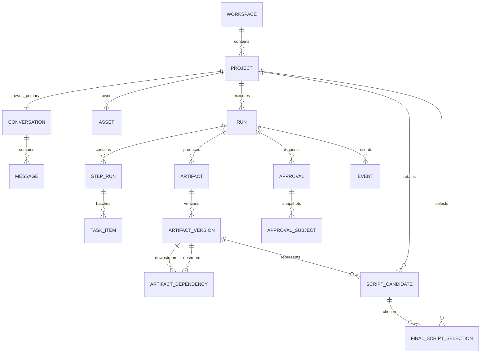
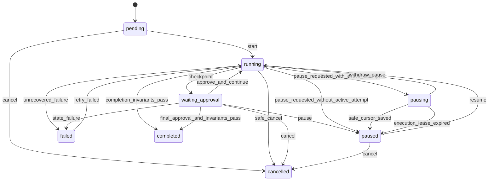
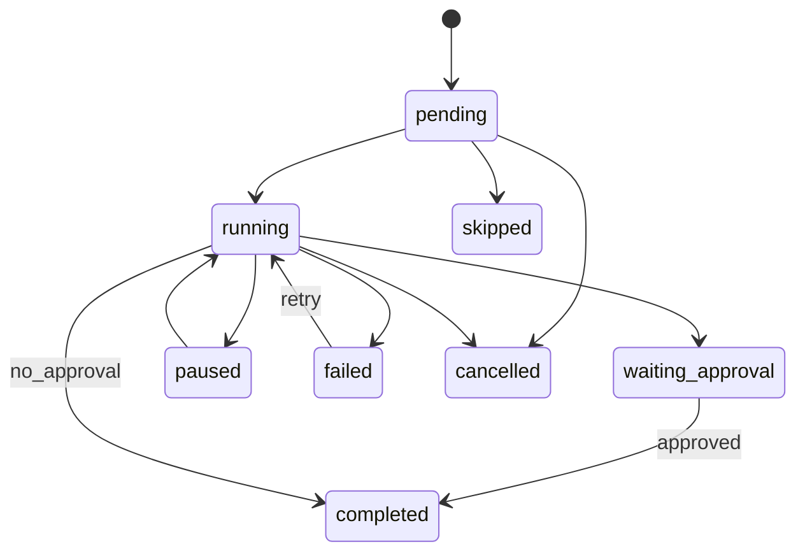
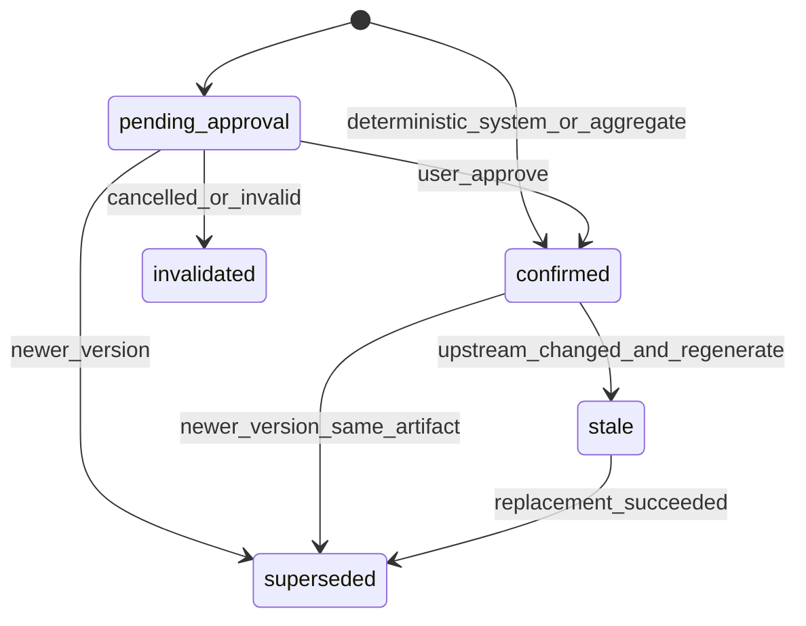

# Runtime Domain Model

状态：阶段 2 设计稿  
版本：v0.1  
日期：2026-07-24

## 1. 文档目的

本文档定义内容生产 Agent 第一版的业务 Runtime 领域模型。

它负责回答：

1. Project、Conversation、Run、Step、Task、Artifact、Approval 和 Event 如何关联；
2. Artifact 如何版本化、审批和追踪上下游；
3. 多个 Skill/Run 产生的候选剧本如何保留；
4. 一部作品如何只拥有一个当前最终稿；
5. 暂停、恢复、失败重试和重新生成如何区分；
6. 同一作品如何避免并发写入冲突；
7. 视频文件如何保存 7 天并在删除后保留来源记录；
8. 服务重启后如何恢复而不重复成功任务。

本文档是业务事实合同，不定义具体页面样式和模型 Prompt。

### 1.1 规范性用语

本文档使用：

- **必须**：实现和测试不可偏离的强制要求；
- **禁止**：实现不得出现的行为；
- **应该**：默认遵循，偏离时必须记录理由和影响；
- **可以**：允许但非强制；
- **建议**：当前推荐实现，不是永久协议；
- **示例**：用于说明结构，不自动成为完整 Schema。

代码实现、API Schema 和测试合同出现冲突时，先停止实现并修正文档或 Schema，不能由某一端静默兼容出第三种语义。

## 2. Runtime 的职责边界

### 2.1 Runtime 负责

- Workspace；
- Project；
- Conversation 和 Message；
- Asset 和文件生命周期；
- Run；
- Step Run；
- Batch Task；
- Artifact 和 Artifact Version；
- Artifact Dependency；
- Approval；
- Event；
- Script Candidate；
- Final Script Selection；
- 并发互斥；
- 幂等；
- 持久化；
- 服务重启恢复；
- 删除和保留策略。

### 2.2 Runtime 不负责

- 自然语言意图判断；
- 生成小说、剧本或分析内容；
- 决定使用哪个模型；
- 保存 Capability Definition；
- 把 Prompt/Rules 当作运行状态；
- 依赖聊天历史推断审批是否已经完成；
- 让 SDK Session 或模型上下文代替业务持久化；
- 让前端本地状态成为业务真源。

### 2.3 权威关系

```text
Agent Shell
-> 提议结构化动作

Guard
-> 检查动作是否合法

Runtime
-> 原子地改变业务状态

SDK Agent / deterministic Worker / Provider
-> 执行被授权的具体任务
```

任何模型回复都不能直接修改 Runtime。

## 3. 规范原则

### 3.1 单一业务状态真源

第一版使用一个业务元数据 SQLite 数据库：

```text
content_agent.db
```

统一保存：

- Project 和 Conversation；
- Run、Step、Task；
- Artifact、Version、Dependency；
- Approval、Event；
- Asset 元数据；
- Candidate 和 Final Selection。

视频、图片、文档原文件不写入 SQLite BLOB/Base64，保存在受控文件存储中。

这样避免现有 Workspace DB 与 Runtime DB 在一次用户操作中出现一边成功、一边失败。

### 3.2 不可变内容版本

以下内容一旦提交就不可原地覆盖：

- Run Input Snapshot；
- Run Config Snapshot；
- Artifact Version Payload；
- Approval Subject Snapshot；
- Event；
- Script Candidate 来源关系；
- Final Selection 历史。

修改通过创建新版本或新记录完成。

### 3.3 状态可变，历史不可改写

Artifact Version 的业务状态可以从 `pending_approval` 变为 `confirmed`，也可能标记为 `stale`。

但其 Payload、来源版本和创建者不能修改。

### 3.4 ID 不承载业务语义

所有 ID：

- 由服务端生成；
- 全局唯一；
- 对前端视为 opaque string；
- 不通过解析 ID 判断时间、类型或集数；
- 业务顺序使用显式字段。

### 3.5 时间规范

- 数据库保存 UTC；
- API 使用 RFC 3339；
- 需要高精度时使用 RFC3339Nano；
- 前端按用户时区显示；
- 排序不能只依赖时间戳，必须有稳定次级键。

### 3.6 Workspace 与用户隔离

- 每个最终用户请求都由认证层建立 Principal，并绑定 Workspace、User 和 Role；
- Project 直接记录 Workspace 与 owner，其他领域对象经 Project 或父资源继承租户边界；
- Actor 只能由 request context 派生，客户端实例 ID 只用于幂等与诊断，不能作为用户身份；
- 仅回环监听的单机开发模式使用固定 local owner，非回环监听必须配置用户认证；
- Sidecar 和 worker 使用独立服务令牌，不能伪装最终用户或调用最终用户写接口。

### 3.7 命名规范

跨层稳定名称：

| 层级 | 规范 |
|---|---|
| JSON API | `snake_case` |
| 数据库表 | 小写、复数、`snake_case` |
| 数据库列 | 小写 `snake_case` |
| Go 导出字段 | `PascalCase`，JSON Tag 使用 `snake_case` |
| TypeScript API 类型 | 字段保持 API 的 `snake_case`，不在客户端静默改名 |
| Capability/Step/Artifact ID | 小写 ASCII `snake_case` |
| 状态枚举 | 小写 ASCII `snake_case` |
| 用户显示名 | 简体中文，通过 Label 映射，不参与业务判断 |

字段后缀：

- 主键和外键：`*_id`；
- 时间：`*_at`；
- 数量：`*_count`；
- 顺序：`*_order`；
- 版本号：`version`；
- Schema 版本：`schema_version`；
- 不可变对象引用：优先保存精确 `*_version_id`；
- 布尔值：使用 `is_*`、`has_*`、`can_*` 或明确动词状态。

禁止：

- 同一含义同时出现 `projectId`、`project_id` 和 `projectID` 三种 API 字段；
- 用中文文案判断状态；
- 用文件名代替 Asset ID；
- 用数组位置代替 Episode Number；
- 用 `metadata` 隐藏已有正式字段；
- 使用 `data`、`info`、`value` 等无领域含义字段承载关键业务状态。

### 3.8 空值和集合规范

- 可选单值使用 `null`，不使用空字符串冒充缺失；
- 空集合使用 `[]`；
- 空对象只有在 Schema 明确允许时使用 `{}`；
- ID 不允许空字符串；
- 时间未发生时使用 `null`；
- 数字未知时使用 `null`，不能用 `0` 同时表示未知和真实值；
- API 不因前端暂时不用某字段而省略关键业务字段；
- Payload 未通过 Schema 时不能进入正式 Artifact Version。

### 3.9 排序规范

所有列表 API 必须声明稳定排序：

- Project：`updated_at DESC, project_id ASC`；
- Message：`created_at ASC, message_id ASC`；
- Project Event：`project_event_seq ASC`；
- Run Event 过滤视图：`run_event_seq ASC`；
- Artifact Version：`version ASC` 或调用方明确指定；
- Episode/Task：`item_order ASC, task_item_id ASC`；
- Candidate：`created_at DESC, candidate_id ASC`。

数据库查询不允许依赖默认返回顺序。

## 4. 聚合边界

第一版使用以下聚合：

```text
Workspace
└─ Project
   ├─ Conversation
   │  └─ Message
   ├─ Asset
   ├─ Run
   │  ├─ Step Run
   │  │  └─ Task Item
   │  ├─ Artifact
   │  │  └─ Artifact Version
   │  ├─ Approval
   │  └─ Event
   ├─ Script Candidate
   └─ Final Script Selection
```

### 4.1 Project 是主要业务边界

以下对象不能跨 Project：

- Conversation；
- Message；
- Asset；
- Run；
- Artifact；
- Approval；
- Candidate；
- Final Selection。

第一版不允许 Artifact Dependency 跨 Project。

### 4.2 Run 是执行边界

每个 Run：

- 只属于一个 Project；
- 只绑定一个顶层 Domain Capability；
- 固定一个 Capability Version；
- 固定一组不可变 Input Snapshot Version 引用；
- 固定一组不可变 Config Snapshot 引用；
- 包含多个 Step Run；
- 可以产生多个 Artifact；
- 可以暂停、恢复、失败和重试；
- 完成后不再原地重新打开。

小说和非小说 Run 启动时各只有一份 sealed Input Snapshot 与 creation Config Snapshot。视频收集型 Run 可以追加新的 Input Snapshot Version，并在进入创作阶段后增加 creation Config Snapshot；每个 Step Run 必须固定本次实际读取的精确 Snapshot ID，不能读取可变“当前值”。

### 4.3 Artifact 是内容边界

Artifact 表示一个有稳定业务身份的产物，例如：

```text
某次 Run 的故事圣经
某次 Run 的第 3 集剧本
某次 Run 的整剧分析
某次 Run 的 adaptation_brief
```

Artifact Version 表示该产物的某一个不可变版本。

## 5. 对象关系图



## 6. Workspace

第一版只有一个逻辑 Workspace。

建议字段：

```json
{
  "workspace_id": "workspace_internal_shared",
  "name": "内容生产 Agent 共享工作区",
  "visibility": "shared_internal",
  "created_at": "",
  "updated_at": ""
}
```

第一版不建设：

- Workspace 切换；
- 成员；
- 角色；
- 权限组；
- 所有者；
- 个人私有空间。

## 7. Project

### 7.1 结构

```json
{
  "project_id": "",
  "workspace_id": "workspace_internal_shared",
  "title": "",
  "status": "ready",
  "primary_conversation_id": "",
  "active_write_run_id": null,
  "current_capability_id": null,
  "current_focus_artifact_version_id": null,
  "current_final_selection_id": null,
  "created_at": "",
  "updated_at": "",
  "deleted_at": null
}
```

### 7.2 Project Status

Project Status 是工作台摘要状态，不是 Run 状态的替代品：

```text
ready
running
waiting_approval
paused
failed
completed
```

建议由当前活动 Run 和最终稿状态派生，不允许前端直接写入。

### 7.3 生命周期

```text
create
-> rename
-> add assets
-> execute runs
-> select final script
-> continue revisions
-> delete
```

第一版删除 Project 是显式破坏性操作：

- 运行中不能直接删除；
- 必须显示影响；
- 用户再次确认；
- 数据库先标记删除；
- 文件删除任务幂等执行；
- 第一版不提供回收站恢复，但 Event 仍记录删除动作。

### 7.4 重命名

重命名只改变 `title`：

- 不改变 Project ID；
- 不改变文件路径语义；
- 不改变 Artifact；
- 不改变导出历史；
- 不改变 Run。

## 8. Conversation

### 8.1 结构

```json
{
  "conversation_id": "",
  "project_id": "",
  "kind": "primary",
  "status": "active",
  "created_at": "",
  "updated_at": ""
}
```

第一版每个 Project 只有一个主 Conversation，但对象必须独立保存，不能把 `project_id` 当作 `conversation_id`。

### 8.2 Message

```json
{
  "message_id": "",
  "conversation_id": "",
  "project_id": "",
  "run_id": null,
  "role": "user",
  "content": "",
  "capability_ref": null,
  "attachment_refs": [],
  "selection_snapshot": null,
  "decision_context": {},
  "created_at": ""
}
```

角色：

```text
user
assistant
system
```

### 8.3 Message 不承担的状态

不能仅靠聊天内容判断：

- Run 是否已经启动；
- 用户是否已经确认；
- Artifact 当前版本；
- 当前最终稿；
- 文件是否已删除；
- Capability 是否可用。

这些事实必须读取 Runtime 对象。

### 8.4 活动 Run 与持续对话

Project 存在活动写 Run 时，主对话仍可继续使用。系统按消息意图区分：

- 普通聊天：Project Scope，不继承活动 Run 的完整上下文；
- 进度查询：读取服务端 `Active Run` 摘要；
- 查看历史记录：使用校验后的 `Viewed Run`，不得覆盖 `Active Run`；
- 定位修改：绑定明确的 Artifact、Version 和 Selection Snapshot；
- 新的有状态生产 Skill：若与当前写 Run 冲突，进入澄清或等待，不直接创建第二个写 Run。

前端不得因 Run 正在执行而整体禁用输入框。只有会破坏状态一致性的具体动作由 Runtime/Guard 阻止。

## 9. Asset

### 9.1 结构

本节只保留 Runtime 摘要。完整 Canonical Schema、Blob、Variant、Parse Result、Asset Set 和 Retention Job 以 `asset-and-retention-contract.md` 为准。

```json
{
  "asset_id": "",
  "project_id": "",
  "kind": "video",
  "source_type": "upload",
  "display_name": "",
  "original_filename": "",
  "extension": "mp4",
  "declared_mime_type": "video/mp4",
  "detected_mime_type": "video/mp4",
  "size_bytes": 0,
  "checksum": "",
  "status": "available",
  "parse_status": "pending",
  "original_blob_id": "",
  "metadata": {
    "duration_ms": 0,
    "width": 0,
    "height": 0,
    "page_count": null,
    "character_count": null
  },
  "retention_policy_id": "video_source_7d_v1",
  "uploaded_at": "",
  "expires_at": null,
  "created_at": "",
  "updated_at": "",
  "deleted_at": null,
  "delete_reason": null
}
```

视频集号、人工顺序、文件名识别候选和缺集确认属于不可变 `Asset Set Version / Asset Set Member`，不写入可变 Asset 顶层。Run 绑定 Asset Set Snapshot，避免排序变化改写已经启动的输入。

### 9.2 Asset Kind

第一版：

```text
text
document
image
video
```

独立音频不支持。

### 9.3 Asset Status

```text
uploading
available
processing
failed
expired
deleted
```

`parse_status`：

```text
not_required
pending
processing
ready
failed
```

文件上传成功不等于解析成功，也不等于启动 Run。

### 9.4 二进制存储

建议：

```text
data/
├─ content_agent.db
└─ assets/
   └─ <project_id>/
      └─ <asset_id>/
         ├─ original
         └─ variants/
```

`storage_ref` 使用受控相对引用，不向浏览器暴露任意服务器路径。

### 9.5 原文件和处理副本

视频原文件不可被压缩或转码覆盖：

```text
Asset
├─ original blob
└─ derived variants
   ├─ provider_upload_copy
   ├─ compressed_copy
   └─ extracted_metadata
```

处理副本通过 `asset_variant` 记录：

```json
{
  "asset_variant_id": "",
  "project_id": "",
  "asset_id": "",
  "source_blob_id": "",
  "blob_id": "",
  "kind": "provider_upload_copy",
  "spec_version": "",
  "status": "ready",
  "created_by_task_id": null,
  "created_at": "",
  "expires_at": null
}
```

### 9.6 视频 7 天保留

规则：

- `expires_at = uploaded_at + 7 days`；
- 后台任务按 `expires_at` 删除原视频和视频处理副本；
- 删除任务幂等；
- 到期删除不删除 Asset 元数据；
- Asset 状态变为 `expired`；
- 已生成 Artifact、分析、Brief 和依赖关系继续保留；
- 用户不能再基于已删除原视频重新解析；
- 界面明确显示原视频已过期。

### 9.7 用户主动删除

已被 Artifact Version 引用的 Asset 不能直接删除。

流程：

```text
request delete
-> calculate impact
-> create deletion approval
-> user confirms
-> mark asset deleted
-> delete blob
-> preserve tombstone and dependencies
```

已有 Artifact 不自动消失。

### 9.8 阶段 3 第 10 步实施基线

截至 2026-07-28，Asset Blob 和删除任务按以下边界实现：

- Schema Version 为 `13`，新增 `retention_jobs` 和不可变 `asset_delete_previews`；
- 上传内容继续使用受控相对 `storage_ref`，数据库只保存 Blob 元数据，不保存 Base64 或任意客户端路径；
- 视频上传提交时，在同一个事务中创建 `expire_video_source` Job，`due_at = uploaded_at + 168 hours`；
- `GET /assets/{asset_id}/content` 只在 Project、Asset、Blob 和绝对到期时间均允许时流式读取，不返回服务端路径；
- 用户删除必须先生成精确影响 Preview，再提交相同 Snapshot Hash 和明确确认；
- Pending/Running/Waiting Approval/Pausing Run 引用会阻止删除；Run 到达 `paused` 或 `failed` 安全状态后，用户可基于新 Preview 明确删除；
- 删除确认先把 Asset/Snapshot 逻辑标记为 `deleted`、Blob 标记为 `delete_pending`，然后创建异步物理删除 Job；
- 自动到期先把 Asset/Snapshot 标记为 `expired` 并撤销读取，再删除 Blob；
- Retention Worker 使用数据库租约、Worker ID、Attempt Count、指数式有界退避和最大重试次数；过期租约可由新 Worker 恢复；
- 文件已经不存在视为幂等删除成功；物理删除失败不会恢复 Asset 可见性；
- Asset Tombstone、Artifact Version、Artifact Dependency 和 Event 保留。

当前系统只生产 Original Blob，因此第 10 步实际删除全部现存 `asset_blobs`。未来 Variant 和 Parse Payload 表接入后继续挂到同一 Asset，并复用同一删除 Job，不改变 Asset/Artifact 边界。

## 10. Run

### 10.1 结构

```json
{
  "run_id": "",
  "project_id": "",
  "conversation_id": "",
  "capability_id": "video_reference_creation",
  "capability_version": "1.0.0",
  "run_kind": "generation",
  "status": "pending",
  "current_step_run_id": null,
  "parent_run_id": null,
  "base_candidate_id": null,
  "current_input_snapshot_version_id": "risv_...",
  "input_snapshot_status": "sealed",
  "config_snapshot": {},
  "started_at": null,
  "ended_at": null,
  "created_at": "",
  "updated_at": "",
  "failure": null
}
```

### 10.2 Run Kind

第一版：

| Kind | 用途 |
|---|---|
| `generation` | 从来源材料开始执行完整 Skill |
| `revision` | 对已完成候选或最终稿继续修改 |

上传、普通聊天、查看文件不创建 Run。

### 10.3 生成 Run

创建条件：

- Capability 可用；
- 必需 Asset 已明确；
- 必需配置已确认；
- 扩写/缺集等转换策略已确认；
- Project 没有其他活动写 Run；
- Input 和 Config Schema 通过。

### 10.4 Revision Run

采用以下规则：

```text
生成 Run 完成前的修改
-> 在同一个 Run 内创建新 Artifact Version

生成 Run 完成后的任何修改
-> 创建 Revision Run
```

Revision Run：

- 指向 `parent_run_id`；
- 指向 `base_candidate_id`；
- 固定被修改的 Artifact Version；
- 手动修改、AI 修改和重新生成都留下 Revision 记录；
- 完成后产生新的 Script Candidate；
- 不自动替换当前最终稿。

这样保证已完成 Run 不被重新打开和改写。

### 10.5 视频来源版本与固定 Run 输入

小说、非小说和视频参考创作 Run 启动时都只创建一个 `sealed` Run Input Snapshot Version。

视频参考创作的分批上传和排序发生在 Run 外：

```text
Asset Set Version 1
-> Asset Set Version 2
用户明确上传完成
-> Sealed Asset Set Version
-> 用户确认启动 Run
-> Sealed Run Input Snapshot Version 1
-> 所有视频 Task 和整剧聚合只绑定该版本
```

Run Input Snapshot Version：

```json
{
  "run_input_snapshot_version_id": "risv_...",
  "run_id": "run_...",
  "version": 3,
  "status": "collecting | sealed | superseded",
  "asset_set_id": "aset_...",
  "asset_set_version_id": "asv_...",
  "asset_snapshot_refs": [],
  "created_at": "",
  "sealed_at": null
}
```

规则：

- 每个 Snapshot Version 提交后不可修改；
- Run 只移动 `current_input_snapshot_version_id`；
- 已创建 Task 保留其精确 `input_snapshot`；
- 新 Asset 不能改写旧 Task 输入；
- 第一版三个 Capability 的 Run 输入均为 `fixed`；视频跨批收集发生在 Run 外的 Asset Set；
- Asset Set Seal 后，Start Run 才生成唯一 `sealed` Run Input Snapshot Version；
- 整剧聚合、分析和 Brief 只能读取该 Run 固定的 sealed Version；
- Seal 后补传必须先 Reopen Asset Set 并形成新版本；已启动 Run 不静默改绑；
- 普通 Capability 不得借此绕过启动前输入确认。

## 11. Run 状态机

### 11.1 状态

```text
pending
running
waiting_approval
pausing
paused
completed
failed
cancelled
```

### 11.2 状态图



### 11.3 终态

```text
completed
cancelled
```

`failed` 不是终态，可以重试或取消。

完成后的内容修改必须创建 Revision Run。

### 11.4 Pause

暂停不是立即杀死进程：

1. 没有活动 Execution Attempt 时，Runtime 直接在当前持久化边界进入 `paused`；
2. 存在活动 Execution Attempt 时，Runtime 记录 `pausing`；
3. Executor 在最近安全边界停止并保存 task cursor；
4. 活动 Attempt 的 Lease 失效时，Runtime 自动放弃该 Attempt 并收敛到 `paused`；
5. `pausing` 期间允许用户撤销暂停，Run 回到 `running`；
6. 已成功 Artifact 和 Task 始终保留。

`pausing` 是有时间边界且有用户出口的过渡态，不允许成为只能通过结束 Run 退出的常驻状态。

模型请求已经发出时：

- 可以尝试取消请求；
- 无法取消时等待结果；
- 如果 Run 已暂停或取消，迟到结果不能直接提交；
- 必须通过 Attempt Token 检查后决定丢弃。

### 11.5 Resume

恢复必须读取：

- 同一个 Capability Version；
- 同一个 Input Snapshot；
- 同一个 Config Snapshot；
- 同一个已确认 Artifact Version Snapshot；
- 同一个未完成 task cursor。

恢复不能重新选择“最新上游”。

### 11.6 Retry

失败重试：

- 只允许 `failed` Run 或失败 Task；
- 创建新的 Execution Attempt；
- 保留旧 Attempt；
- 从失败 cursor 继续；
- 不重新执行成功 Task；
- 不创建重复成功 Artifact。

### 11.7 Cancel

取消：

- 停止未来任务；
- 保存已完成记录；
- 不删除已经产生的 Artifact；
- 未提交模型输出不保存为成功 Artifact；
- Run 进入 `cancelled`；
- 释放 Project 写锁。

## 12. Input Snapshot

Run 启动时固定：

```json
{
  "asset_refs": [
    {
      "asset_id": "",
      "checksum": "",
      "role": "primary_source",
      "episode_no": null,
      "episode_order": null
    }
  ],
  "source_kind": "novel",
  "user_request_message_id": "",
  "confirmed_strategy_refs": []
}
```

Asset 后续改名不影响 Snapshot。Asset 被删除后 Snapshot 仍保留 ID、Checksum 和来源状态。

## 13. Config Snapshot

```json
{
  "schema_version": "1.0",
  "target_episode_count": 20,
  "episode_duration_minutes": 2,
  "preserve_existing_episode_marks": false,
  "expansion_policy": "confirm_if_needed",
  "user_requirements": []
}
```

Config Snapshot：

- 创建后不可原地修改；
- Artifact 只保存 Config Snapshot 引用，不复制多份权威配置；
- 用户改变配置时先计算影响；
- 未开始关键步骤时可以创建新 Run；
- 已有下游时创建 Revision/Regeneration Run；
- 不能在运行中静默改变集数。

小说/非小说体量不足时，用户实际选择的扩写策略保存为 `volume_fit` Approval Resolution 和 Decision Snapshot，不原地修改启动时的 Creation Config Snapshot。后续 Step 同时绑定原 Config Snapshot 与该 Approval/Decision Snapshot。

### 13.1 多阶段 Capability

“Run 固定 Config Snapshot”是 Step 输入一致性约束，不表示一个长流程只能存在一种配置语义。

`video_reference_creation` 第一版存在两个阶段：

1. Run 外的视频收集由 Asset Set Version 管理；Run 启动后的提取阶段绑定 `extraction_config_snapshot`；
2. 用户确认改编方法、目标集数和单集时长后，创建 `creation_config_snapshot`；
3. `story_seed` 及创作下游只绑定第二份快照；
4. 每个 Step Run 的 `input_version_snapshot` 必须保存实际使用的精确 Config Snapshot ID；
5. 已完成 Step 不因后续创建第二份快照而改变；
6. 任一 Config Snapshot 都不可原地修改。

这仍是同一个 `video_reference_creation` Run，不是 Capability 跳转。对已进入创作下游的 `creation_config_snapshot` 再做修改时，继续遵守新建 Revision/Regeneration Run 的规则。

## 14. Step Run

### 14.1 结构

```json
{
  "step_run_id": "",
  "run_id": "",
  "step_id": "",
  "workflow_module_id": null,
  "status": "pending",
  "attempt_count": 0,
  "approval_policy": "checkpoint",
  "input_version_snapshot": [],
  "task_cursor": {},
  "started_at": null,
  "ended_at": null,
  "failure": null
}
```

### 14.2 Step 状态

```text
pending
running
waiting_approval
paused
completed
failed
skipped
cancelled
```

### 14.3 Step 状态图



### 14.4 Input Version Snapshot

Step 开始前固定其读取的上游：

```json
[
  {
    "artifact_id": "",
    "artifact_version_id": "",
    "version": 2,
    "status": "confirmed"
  }
]
```

这份 Snapshot 是 Artifact Dependency 的来源。

## 15. Task Item

Task Item 用于批量步骤中的最小恢复单元。

### 15.1 结构

```json
{
  "task_item_id": "",
  "step_run_id": "",
  "run_id": "",
  "item_key": "episode:3",
  "item_order": 3,
  "status": "pending",
  "attempt_count": 0,
  "input_snapshot": {},
  "cursor": {},
  "output_artifact_version_id": null,
  "started_at": null,
  "ended_at": null,
  "failure": null
}
```

### 15.2 Task 状态

```text
pending
running
succeeded
failed
paused
cancelled
```

### 15.3 稳定顺序

批量输出按 `item_order` 聚合。

禁止按：

- 模型完成时间；
- Event 到达时间；
- 文件系统顺序；
- 数据库无 ORDER BY 返回顺序。

### 15.4 视频 Task

每个视频默认一个 Task：

```text
item_key = asset:<asset_id>
item_order = episode_order
```

用户人工调整顺序只改变尚未确认的 Episode Mapping，不改 Asset ID。

### 15.5 Script Task

每集剧本：

```text
item_key = episode:<episode_no>
item_order = episode_no
```

成功一集立即保存对应 `script_unit` Version。

## 16. Execution Attempt

每次模型/工具执行保存 Attempt：

```json
{
  "attempt_id": "",
  "run_id": "",
  "step_run_id": "",
  "task_item_id": null,
  "attempt_no": 1,
  "executor_id": "",
  "provider_id": "",
  "request_fingerprint": "",
  "status": "running",
  "started_at": "",
  "ended_at": null,
  "error_code": null,
  "usage": {},
  "trace_ref": null
}
```

作用：

- 防止迟到结果写入；
- 区分重试；
- 记录 Provider 请求；
- 诊断超时和结构失败；
- 未来统计耗时和成本。

API Key、完整隐私输入和未经脱敏的原视频 URL 不写入 Trace。

## 17. Artifact

### 17.1 逻辑身份

```json
{
  "artifact_id": "",
  "project_id": "",
  "run_id": "",
  "step_run_id": "",
  "capability_id": "",
  "workflow_module_id": null,
  "artifact_type": "script_unit",
  "scope_key": "episode:3",
  "current_version_id": "",
  "created_at": "",
  "updated_at": ""
}
```

### 17.2 Scope Key

`scope_key` 区分同类型子项：

```text
singleton
episode:1
episode:2
video_asset:<asset_id>
```

在同一个 Run 中建议唯一：

```text
(run_id, artifact_type, scope_key)
```

不同 Run 的同类型 Artifact 不能被当作同一个逻辑 Artifact。

### 17.3 Artifact Type

Artifact Type 来自 Artifact Schema Registry，不允许 Runtime 接受任意模型字符串创建正式 Artifact。

第一版主要类型：

```text
source_input
story_bible
episode_split
material_bank
story_seed
series_blueprint
episode_cards
script_context
script_unit
scripts
video_script_unit
reference_scripts
script_analysis
adaptation_options
adaptation_brief
```

视频原文件和视频集合属于 Asset / Asset Set / Run Input Snapshot，不注册 `video_source` Artifact Type。`video_source` 只能作为产品文案或 Asset purpose 使用。

## 18. Artifact Version

### 18.1 结构

```json
{
  "artifact_version_id": "",
  "artifact_id": "",
  "version": 3,
  "status": "pending_approval",
  "payload": {},
  "schema_id": "script_unit",
  "schema_version": "1.0.0",
  "created_by": {
    "kind": "model | user | system",
    "actor_ref": ""
  },
  "creation_reason": "initial | manual_edit | ai_revision | regeneration | aggregate",
  "base_version_id": "",
  "created_at": "",
  "confirmed_at": null
}
```

### 18.2 Payload 不可变

保存后：

- 不允许 PATCH 原 Payload；
- 编辑创建新 Version；
- 新 Version 必须携带 `base_version_id`；
- `version = previous + 1`；
- 旧 Version 永久保留；
- Current Version Pointer 在事务中切换。

### 18.3 Version Status

```text
pending_approval
confirmed
stale
superseded
invalidated
```

定义：

| 状态 | 含义 |
|---|---|
| `pending_approval` | 已生成或已编辑，等待用户确认 |
| `confirmed` | 用户明确接受，可作为下游输入 |
| `stale` | 上游变化后仍保留，但不应自动用于新下游 |
| `superseded` | 同一 Artifact 已有更新版本，保留历史 |
| `invalidated` | 因取消、错误恢复或明确业务操作不再有效 |

失败模型输出不创建 Artifact Version。

需要用户确认的 Artifact 一律以 `pending_approval` 创建。只有 `approval.type=none` 的确定性 `system/aggregate` Step，且所有声明的上游版本均已确认、Schema 和依赖校验全部通过时，Runtime 才能直接创建 `confirmed` Version；模型 Step 不得使用该例外。

### 18.4 Version 状态转换



### 18.5 已确认版本后的修改

创建新 Version 后：

- 原 `confirmed` Version 保留；
- 新 Version 为 `pending_approval`；
- 原 Approval 继续作为历史事实；
- 新 Version 没有继承确认；
- 下游继续显示但标记潜在影响；
- 用户选择保留或重生成。

## 19. Artifact Dependency

### 19.1 结构

```json
{
  "dependency_id": "",
  "project_id": "",
  "downstream_artifact_version_id": "",
  "upstream_kind": "artifact_version | asset | config_snapshot",
  "upstream_ref_id": "",
  "relation": "derived_from",
  "created_at": ""
}
```

### 19.2 版本级依赖

必须记录：

```text
下游 Artifact Version
-> 精确上游 Artifact Version
```

不能只记录：

```text
script_unit -> episode_cards
```

必须能回答：

```text
第 3 集剧本 v4 使用的是分集卡 v2 的哪一集
```

### 19.3 Asset 依赖

视频剧本必须绑定：

- Asset ID；
- Asset checksum；
- 时间范围；
- Episode Mapping。

Asset 过期后 Dependency 仍存在。

### 19.4 下游影响计算

修改上游后：

1. 从旧 Version 查找实际下游 Version；
2. 过滤已经 superseded/invalidated 的历史；
3. 按 Project 和 Run 限制；
4. 返回受影响 Artifact、集数和 Candidate；
5. 用户选择保留或重生成；
6. 不立即删除下游。

### 19.5 保留下游

选择保留：

- 下游 Version 保持可用；
- 记录 `keep_downstream` Event；
- 记录上游不一致已被用户接受；
- 后续新生成步骤不能假装依赖已更新；
- 需要在 Dependency/Decision Snapshot 中保留这次选择。

### 19.6 重生成下游

选择重生成：

- 受影响旧 Version 标记 `stale`；
- 从最早受影响 Step 创建/恢复任务；
- 新 Version 成功前旧内容继续可见；
- 新 Version 成功后旧 Version 标记 `superseded`；
- 未受影响集数不重做。

## 20. Approval

### 20.1 结构

```json
{
  "approval_request_id": "",
  "project_id": "",
  "run_id": "",
  "step_run_id": "",
  "scope": "artifact",
  "status": "pending",
  "title": "",
  "reason": "",
  "options": [],
  "requested_at": "",
  "resolved_at": null,
  "resolution": null,
  "actor_ref": null
}
```

### 20.2 Approval Subject

单产物确认：

```json
{
  "subject_kind": "artifact_version",
  "subject_ref_id": "av_...",
  "subject_version": 3,
  "snapshot_hash": ""
}
```

批量剧本确认：

```json
{
  "subject_kind": "artifact_version_set",
  "subject_ref_id": "step_run_id",
  "subject_version": 2,
  "snapshot_hash": ""
}
```

`approval_subject_versions` 按 `item_order` 保存该确认请求绑定的全部精确
`script_unit` Version 和 `scope_key`。确认时必须同时校验：

- 每个版本仍是对应 Artifact 的 Current Version；
- 每个 Task 的 Output Version 仍与快照一致；
- 全部版本仍是 `pending_approval`；
- 重新计算的集合 Hash 与 Approval Snapshot Hash 一致。

任意单集编辑会使旧集合 Approval `expired`，只替换被编辑集的 Version，
其余集版本原样进入新的集合快照。禁止为每一集再创建独立 Approval。

### 20.3 Approval Status

```text
pending
approved
rejected
cancelled
expired
```

### 20.4 Approval 不可迁移

Approval 只对 Subject Snapshot 生效。

如果 Artifact 创建新 Version：

- 旧 Approval 不适用于新 Version；
- 未解决的旧 Approval 标记 `expired`；
- 创建新的 Approval；
- 已解决 Approval 保留历史。

### 20.5 Approval Scope

第一版：

```text
artifact
batch
transition
final_selection
asset_deletion
project_deletion
```

### 20.6 结构化 Resolution

```json
{
  "action": "approve | keep_downstream | regenerate_downstream | continue_incomplete | confirm_delete",
  "note": "",
  "resolved_subject_refs": []
}
```

不能只保存一段用户自然语言作为审批结果。

Pause、Resume、Retry 和 Cancel 通过独立 Run/Task Command 执行，不属于 Approval Resolution。等待确认期间若允许暂停，Runtime 同时投影 `pause_run`，但不把它写进 Approval Options。

## 21. Event

### 21.1 结构

```json
{
  "event_id": "",
  "event_type": "artifact.version_created",
  "schema_version": 1,
  "project_id": "",
  "conversation_id": null,
  "run_id": null,
  "step_run_id": null,
  "task_item_id": null,
  "project_event_seq": 42,
  "run_event_seq": 7,
  "actor": {
    "kind": "shared_workspace_user | agent | runtime | worker | provider | system",
    "ref": ""
  },
  "subject": {
    "resource_type": "artifact_version",
    "resource_id": ""
  },
  "payload": {},
  "command_id": null,
  "causation_event_id": null,
  "correlation_id": null,
  "occurred_at": ""
}
```

### 21.2 Append-only

Event：

- 只追加；
- 不修改；
- 不删除单条；
- Project 删除时按产品删除策略整体处理；
- 可以重建时间线；
- 不能替代当前状态表。

### 21.3 Event 与状态

第一版采用：

```text
Current State Tables
+ Append-only Events
```

不是纯 Event Sourcing。

原因：

- 当前团队和第一版工程量不需要完整 Event Sourcing；
- 状态查询需要简单可靠；
- Event 主要用于审计、时间线、调试和 SSE；
- 状态和 Event 必须在同一事务提交。

### 21.4 Event 顺序

每个 Project 增加单调递增：

```text
project_event_seq
```

属于 Run 的 Event 同时增加：

```text
run_event_seq
```

Project 工作台 SSE 使用 `(project_id, project_event_seq)` 恢复；Run 过滤流使用 `(run_id, run_event_seq)`。不能按时间戳或 Event ID 字典序恢复。

### 21.5 阶段 3 第 7 步实施基线

截至 2026-07-28，Runtime 事件基础设施按以下边界实现：

- Event 与业务状态在同一个 SQLite 事务中提交；
- 每条 Event 同事务写入 `event_outbox`，不允许出现只有状态、没有待发布记录的提交；
- `events(project_id, project_event_seq)` 和 `events(run_id, run_event_seq)` 保持唯一；
- 数据库 Trigger 拒绝单条 Event 的 `UPDATE` 和 `DELETE`；
- Project 和 Run 分别提供按 Seq、正序、有限批次读取的重放接口；
- Cursor 小于 0 被拒绝，Cursor 超过服务端当前 Seq 时要求客户端重新获取 Snapshot；
- 相同时间戳不影响排序，Event ID 也不参与排序；
- Event 仍只承担审计、时间线和 SSE，不替代 Project、Run、Artifact、Approval 等当前状态表。

第一版 Event 随 Project 保留，因此暂不产生 Cursor Too Old；如果后续引入事件保留窗口，必须先增加 `min_available_seq`，不能静默跳过缺口。

## 22. Script Candidate

### 22.1 结构

```json
{
  "candidate_id": "",
  "project_id": "",
  "source_run_id": "",
  "source_capability_id": "",
  "scripts_artifact_version_id": "",
  "status": "candidate",
  "label": "",
  "created_at": "",
  "supersedes_candidate_id": null
}
```

### 22.2 创建条件

生成或 Revision Run 满足：

- 目标集数完整；
- 所有必需 `script_unit` 已确认；
- `scripts` 聚合基于这些精确 Version；
- 最终剧本步骤确认；
- Completion Invariants 通过。

然后创建 Script Candidate。

### 22.3 Candidate Status

```text
candidate
final
historical_final
superseded
```

Candidate 不因未被选为最终稿而删除。

### 22.4 Revision

完成后的修改产生新的 Candidate：

```text
Candidate A
-> Revision Run
-> Candidate B
```

通过 `supersedes_candidate_id` 保留关系。

### 22.5 阶段 3 第 9 步实施基线

截至 2026-07-28，Candidate 按以下边界实现：

- Schema Version 为 `12`，`script_candidates` 通过 `scripts_artifact_version_id` 唯一绑定一个精确聚合版本；
- `scripts` 聚合版本确认、Candidate 创建和 Run 完成在同一个事务中提交；
- Candidate 创建后保持 `candidate`，不会自动成为最终稿；
- 第一版已支持生成 Run 产生 Candidate；Revision Run 的 `base_candidate_id` 和 `supersedes_candidate_id` 串联在第 11 步迁移文本 Skill 时接入；
- Candidate 引用的 `scripts` Version 为 `confirmed` 或 `superseded` 时可以选择；`pending_approval`、`stale`、`invalidated` 不可选择；
- `superseded` 仅表示该 Artifact 已有新版本，不抹除该 Candidate 曾经确认的历史事实。

## 23. Final Script Selection

### 23.1 结构

```json
{
  "final_selection_id": "",
  "project_id": "",
  "candidate_id": "",
  "approval_request_id": "",
  "selection_no": 2,
  "status": "active",
  "selected_at": "",
  "replaced_selection_id": null
}
```

### 23.2 规则

- 一部 Project 同时只有一个 active Final Selection；
- 首次选择需要 `final_selection` Approval；
- 改选历史 Candidate 也需要 Approval；
- 新 Selection 创建后，旧 Selection 标记 `replaced`；
- 旧 Candidate 标记 `historical_final`；
- 不删除旧最终稿；
- Candidate 后续修订不自动改变当前最终稿。

### 23.3 数据库约束

已使用两个部分唯一索引：

```sql
UNIQUE script_candidates(project_id) WHERE status = 'final'
UNIQUE final_selections(project_id) WHERE status = 'active'
```

选择分为 Preview 和 Confirm 两个命令。Preview 固定 Candidate、当前 Active Selection、拟产生的 `selection_no` 和 Approval Subject Snapshot；Confirm 必须提交相同 Preview Hash 和明确确认。新的 Preview 会使同 Project 旧的 Pending Preview 及其 Approval 过期。

`final_selection` Approval 复用现有非空 `run_id/step_run_id` 结构，关联 Candidate 的来源 Run 和聚合 Step，但它属于 Project 级选择审批。Run 生命周期、暂停、恢复、取消和普通 Approval Resolution 都排除该 Scope，只能由 Final Selection Confirm 命令解决。

Project 的 `current_final_selection_id` 由唯一 Active Selection 查询投影，不维护第二个可漂移的数据库 Pointer；确认选择时同步更新 `current_focus_artifact_version_id`。

## 24. 编辑协议

### 24.1 乐观锁

所有保存必须携带：

```json
{
  "artifact_id": "",
  "base_version_id": "",
  "base_version": 3,
  "new_payload": {}
}
```

Runtime 检查：

- Base Version 是否仍为 Current；
- Run 是否允许编辑；
- Artifact Type 是否允许用户编辑；
- Schema 是否通过；
- Project 是否有冲突写 Run；
- 用户是否正在编辑受运行读取的上游。

运行状态约束：

- `waiting_approval`：允许编辑当前 Approval 绑定的 Artifact，保存后旧 Approval 失效并创建新 Approval；
- `paused`：允许编辑，但若修改当前 cursor 已绑定或后续将读取的 Artifact，必须把 cursor 标记为 `input_changed`，计算 Impact Preview，并移除直接 `resume`；
- `running`、`pausing`：不允许内容编辑；
- `completed`：不原地编辑，必须创建 Revision Run。

因此“暂停后编辑”不会带着旧输入静默恢复。用户必须明确选择保留下游、从受影响步骤重生成，或放弃本次修改。

冲突返回 HTTP 409 和最新 Version。

### 24.2 手动编辑

手动编辑创建：

- 新 Artifact Version；
- `created_by.kind=user`；
- `creation_reason=manual_edit`；
- Event；
- 新 Approval 或影响确认。

### 24.3 AI 修改

AI 修改：

- 先创建结构化 Revision Intent；
- 固定 Target Version 和 Selection Snapshot；
- 创建 Execution Attempt；
- 模型只返回目标 Patch；
- Runtime 应用 Patch；
- Schema 校验；
- 创建新 Artifact Version；
- 不能让模型提交整个不相关 Artifact 覆盖。

### 24.4 重新生成

重新生成：

- 固定输入版本；
- 创建新 Attempt；
- 创建新 Artifact Version；
- `creation_reason=regeneration`；
- 保留旧 Version；
- 重新审批；
- 计算下游影响。

## 25. 并发模型

### 25.1 Project 写互斥

同一 Project 同时只允许一个活动写 Run。

活动状态：

```text
pending
running
waiting_approval
pausing
paused
failed
```

`failed` Run 在用户重试或取消前继续占有主流程位置，避免静默启动冲突 Run。

### 25.2 数据库约束

阶段 3 第 8 步已实现：

```sql
CREATE UNIQUE INDEX one_active_write_run_per_project
ON runs(project_id)
WHERE write_intent = 1
  AND status IN (
    'pending',
    'running',
    'waiting_approval',
    'pausing',
    'paused',
    'failed'
  );
```

不能只依赖前端禁用按钮或进程内 mutex。

实施门禁：

- 即使绕过 Runtime 直接写 `runs` 表，同一 Project 的第二个活动写 Run 也会被数据库拒绝；
- `completed` 和 `cancelled` 退出活动集合，允许同一 Project 启动后续 Run；
- `failed` 在用户重试或取消前仍属于活动集合；
- 不同 Project 可以各自持有一个活动写 Run；
- Runtime 只把 `one_active_write_run_per_project` 对应的唯一约束映射为 `PROJECT_WRITE_RUN_CONFLICT`，其他数据库唯一约束不得误报成活动 Run 冲突；
- Project 的 `active_write_run_id` 与 Run 终态更新在同一事务完成。

### 25.3 不同 Project 并发

不同 Project 可以同时运行，但受：

- 全局模型请求并发；
- Provider 并发；
- 视频处理并发；
- 数据库写入；
- 服务资源限制。

### 25.4 全局并发控制

第一版使用服务端并发控制器：

```text
text_model_limit
video_model_limit
media_processing_limit
```

暂时没有资源时：

- Task 保持 `pending`；
- 前端显示等待执行资源；
- 不宣传为隐藏用户任务队列；
- Project Run 状态和等待原因可见；
- 服务重启后从持久化 pending Task 恢复。

## 26. 幂等

### 26.1 API 幂等键

以下操作必须支持 Idempotency Key：

- 创建 Run；
- Resolve Approval；
- Pause/Resume/Cancel；
- Retry Task；
- 保存 Artifact Edit；
- 选择 Final Candidate；
- 确认删除；
- 上传完成回调。

结构：

```text
idempotency_key
operation_type
project_id
request_hash
response_snapshot
created_at
expires_at
```

同一个 Key + 不同 Request Hash 返回冲突。

### 26.2 Provider 结果幂等

提交模型结果时检查：

- Attempt ID；
- Task 当前 Attempt；
- Run/Step/Task 状态；
- 输入 Snapshot Hash；
- 是否已有成功输出。

迟到或重复结果不创建第二份 Version。

## 27. 事务边界

### 27.1 创建 Run

同一事务：

1. 校验 Project 写互斥；
2. 创建 Run；
3. 保存 Input/Config Snapshot；
4. 创建首个 Step Run；
5. 更新 Project Active Run；
6. 写 Event；
7. 保存 Idempotency Result。

### 27.2 保存 Artifact Version

同一事务：

1. 检查 Attempt；
2. 检查 Base/Upstream Version；
3. 创建 Artifact 或 Version；
4. 创建 Dependency；
5. 更新 Current Version Pointer；
6. 更新 Task/Step 状态；
7. 创建 Approval 或进入下一步骤；
8. 写 Event。

### 27.3 Resolve Approval

同一事务：

1. 检查 Approval 是 pending；
2. 检查 Subject Version 未变化；
3. 写 Resolution；
4. 更新 Artifact Version 状态；
5. 更新 Step/Run；
6. 创建下一 Step 或完成 Run；
7. 写 Event；
8. 保存幂等结果。

### 27.4 Final Selection

同一事务：

1. 检查 Selection Approval；
2. 检查 Candidate 仍有效；
3. 替换旧 Active Selection；
4. 创建新 Selection；
5. 更新 Candidate 状态；
6. 更新 Project 当前焦点并由 Active Selection 投影当前最终稿；
7. 写 Event。

### 27.5 文件删除

数据库事务不能与文件系统删除完全原子。

采用：

```text
transaction: mark delete_pending + create deletion job
-> commit
-> idempotent blob deletion
-> transaction: mark deleted/expired
```

失败时 Job 可重试，Asset 元数据仍说明真实状态。

Runtime Server 启动时立即执行一次到期扫描，之后按 `retention-interval` 周期执行。`retention-lease-seconds` 和 `retention-max-attempts` 控制租约与失败上限；多个服务实例使用不同进程级 Worker ID 竞争领取。

## 28. SQLite 规范

第一版建议：

```text
PRAGMA journal_mode=WAL
PRAGMA foreign_keys=ON
PRAGMA busy_timeout=5000
PRAGMA synchronous=FULL
```

要求：

- schema version；
- 顺序 migration；
- 不允许高版本 DB 被低版本程序打开写入；
- 发布前自动备份；
- migration 失败不启动服务；
- 每个事务有明确超时；
- 查询全部带稳定 ORDER BY；
- JSON 字段只保存难以固定列化的 Payload/Snapshot；
- 关键关联和状态必须是可索引列。

## 29. 建议数据表

```text
workspaces
projects
conversations
messages
message_asset_refs
assets
asset_variants
run_input_snapshot_versions
runs
step_runs
task_items
execution_attempts
artifacts
artifact_versions
artifact_dependencies
approvals
approval_subject_versions
events
commands
outbox
script_candidates
final_script_selections
idempotency_records
deletion_jobs
```

Capability Definitions、Prompt、Rules 和 Artifact Schemas 属于发布包，不作为用户业务数据写入这些表。

## 30. 服务重启恢复

启动时：

1. 完成 DB Migration；
2. 加载 Capability Registry；
3. 校验所有未完成 Run 的 Capability Version；
4. 扫描 `running` Attempt；
5. 将无法证明仍在执行的 Attempt 标记为 interrupted；
6. Run/Step/Task 进入可恢复失败状态；
7. 恢复 pending deletion jobs；
8. 恢复等待资源的 Task；
9. 保留 pending Approval；
10. 校正 Project Active Run Pointer；
11. 不自动重复提交模型任务，除非有明确幂等恢复协议。

前端刷新读取服务端快照：

- Project；
- Active Run；
- Current Step；
- Tasks；
- Artifacts；
- Pending Approval；
- Events after seq。

## 31. 错误模型

统一结构：

```json
{
  "code": "ARTIFACT_VERSION_CONFLICT",
  "message": "当前内容已产生新版本，请刷新后处理。",
  "retryable": false,
  "scope": "artifact",
  "run_id": "",
  "step_run_id": "",
  "task_item_id": null,
  "details": {},
  "suggested_actions": [
    "refresh_artifact"
  ]
}
```

第一版关键错误码：

```text
PROJECT_WRITE_RUN_CONFLICT
CAPABILITY_UNAVAILABLE
CAPABILITY_VERSION_MISSING
INPUT_SCHEMA_INVALID
CONFIG_SCHEMA_INVALID
ASSET_NOT_AVAILABLE
ASSET_EXPIRED
ARTIFACT_SCHEMA_INVALID
ARTIFACT_VERSION_CONFLICT
APPROVAL_SUBJECT_CHANGED
RUN_NOT_PAUSABLE
RUN_NOT_RESUMABLE
TASK_NOT_RETRYABLE
MODEL_TIMEOUT
MODEL_RATE_LIMIT
PROVIDER_FAILURE
OUTPUT_PARSE_FAILED
OUTPUT_SCHEMA_INVALID
DEPENDENCY_CONFLICT
INCOMPLETE_BATCH
FINAL_SELECTION_CONFLICT
```

## 32. 三条 Skill 的领域对象映射

### 32.1 小说转剧本

```text
Project
-> Generation Run(capability=novel_to_script)
-> Steps
-> story_bible Artifact
-> episode_split Artifact
-> episode_cards Artifact
-> script_unit Artifacts by episode
-> scripts Aggregate
-> Script Candidate
-> optional Final Selection
```

### 32.2 非小说文本转剧本

```text
Project
-> Generation Run(capability=non_novel_to_script)
-> material_bank
-> story_seed
-> series_blueprint
-> episode_cards
-> script_unit[]
-> scripts
-> Script Candidate
```

### 32.3 视频参考创作

```text
Project
-> Video Assets
-> Generation Run(capability=video_reference_creation)
-> Video Parse Task Items
-> video_script_unit[]
-> reference_scripts
-> script_analysis
-> adaptation_options
-> adaptation_brief
-> shared workflow Step Runs
-> script_unit[]
-> scripts
-> Script Candidate
```

整个 Run 保持同一个 Capability ID。

## 33. 关键不变量

Runtime 每次写入都必须维护：

1. 一个 Run 只属于一个 Project；
2. 一个 Run 只绑定一个 Capability ID 和 Version；
3. 一个 Project 同时最多一个活动写 Run；
4. Artifact 不能跨 Project 依赖；
5. Artifact Version Payload 保存后不可修改；
6. 新 Version 必须引用 Base Version；
7. 下游必须引用精确上游 Version；
8. Approval 只对固定 Subject Version 生效；
9. 新 Artifact Version 不继承旧 Approval；
10. 批量 Step 未完成所有必需 Task 时不能确认；
11. Run 未通过 Completion Invariants 时不能完成；
12. Completed Run 不重新打开；
13. Completed Run 后修改必须创建 Revision Run；
14. Revision Run 完成后创建新 Candidate；
15. Project 同时最多一个 Active Final Selection；
16. 改选最终稿不删除历史 Final；
17. Asset Blob 删除不删除来源元数据和依赖；
18. Event 与状态变更同事务提交；
19. Provider 迟到结果不能绕过 Attempt 校验；
20. 模型回复不能直接改变任何状态。

## 34. 现有项目迁移

本节保留 Runtime 摘要。完整源快照、ID 映射、Artifact Adapter、兼容 API、未完成 Run Continuation、Cutover 和回滚方案以 `data-migration-compatibility-plan.md` 为准。

### 34.1 当前来源

现有项目主要数据：

- `workspace.db`：Project、Message、File；
- `runtime.db`：Run、Event、Artifact、Approval JSON；
- 文件 Base64；
- Project `source_mode`；
- Run `source_mode`；
- Artifact `derived_from []string`。

### 34.2 迁移目标

```text
workspace.db + runtime.db
-> content_agent.db

file content_base64
-> controlled asset storage
```

### 34.3 兼容映射

| 旧字段 | 新字段 |
|---|---|
| Project `source_mode` | 迁移为最近 Run 输入属性，不再定义 Project |
| Run `source_mode=novel` | `capability_id=novel_to_script` |
| Run `source_mode=non_novel` | `capability_id=non_novel_to_script` |
| Artifact 唯一 ID 每版本 | 拆为 Artifact Logical ID + Artifact Version ID |
| `derived_from []string` | 解析为 Version Dependency；无法确认时标记 legacy |
| File Base64 | 写入 Asset Blob，DB 保存 storage_ref |
| Project active artifacts map | 迁移为 Artifact current pointer/query |
| Project active run | 校验真实 Run 状态后重建 |

### 34.4 迁移规则

- 迁移前备份两个 DB 和文件；
- 迁移工具只读旧 DB；
- 生成新 DB，不原地改写旧 DB；
- 校验 Project、Run、Artifact 和 Message 数量；
- 校验每个 Script Unit 版本；
- 无法还原精确依赖时保留 `legacy_dependency_unresolved`；
- 旧项目迁移后进行刷新、审批、编辑和导出回归；
- 迁移成功前不删除旧数据。

## 35. 不采用的方案

### 35.1 继续两个独立 SQLite 状态库

不作为目标架构。跨库操作无法获得简单原子性，恢复成本高。

### 35.2 把视频存进 SQLite Base64

不采用。几十集视频会导致数据库体积、内存和备份不可控。

### 35.3 原地覆盖 Artifact Payload

不采用。会丢失版本、审批和依赖证据。

### 35.4 只在 Project 保存最新 Artifact ID

不采用。无法表达候选稿、历史版本和精确依赖。

### 35.5 完成 Run 后继续改原 Run

不采用。完成态会失去可信度，历史无法审计。

### 35.6 使用纯 Event Sourcing

第一版不采用。保留 Append-only Event，但当前状态使用关系表。

### 35.7 前端负责并发锁

不采用。数据库必须具有最终互斥约束。

## 36. 测试要求

### 36.1 聚合隔离

- 两个 Project 的 Asset、Run、Artifact 不串用；
- Dependency 拒绝跨 Project；
- Conversation 不串用；
- 不同 Project 同时运行。

### 36.2 Run 状态机

- 合法转换通过；
- 非法转换拒绝；
- Pause 保存安全 cursor；
- Resume 不替换输入版本；
- Retry 不重做成功 Task；
- Cancel 不删除已成功 Artifact；
- Completed Run 不可重开。

### 36.3 Artifact Version

- 手动编辑创建新 Version；
- AI 修改创建新 Version；
- 重新生成创建新 Version；
- 旧 Version 保留；
- Base Version 冲突返回 409；
- 新 Version 不继承确认。

### 36.4 Dependency

- 每个下游绑定精确上游 Version；
- 修改上游正确计算影响；
- 保留下游不删除内容；
- 重生成只处理受影响内容；
- 无关集数版本不变。

### 36.5 Approval

- Approval 固定 Subject Version；
- 新 Version 使 pending Approval expired；
- 已解决 Approval 保留；
- Batch Approval 包含全部成功子项；
- 缺一集不能确认；
- Resolve 重复请求幂等。

### 36.6 Candidate 和 Final

- 不同 Skill Run 产生多个 Candidate；
- 选择 Final 需要 Approval；
- 同时只有一个 Active Final；
- 改选保留旧 Final；
- 修改 Final 创建 Revision Run 和新 Candidate；
- 新 Candidate 不自动替换 Final。

### 36.7 Asset

- 上传不启动 Run；
- 视频原文件与处理副本分离；
- 7 天到期删除 Blob；
- 元数据和依赖保留；
- 已引用 Asset 删除需要确认；
- 删除失败任务可重试；
- 过期视频不能重新解析。

### 36.8 重启恢复

- Running Attempt 被识别为 interrupted；
- 成功 Task 不重复；
- Pending Approval 保留；
- Active Run Pointer 修复；
- Pending Deletion Job 恢复；
- SSE 从 seq 继续。

### 36.9 并发和幂等

- 同 Project 第二个写 Run 被数据库拒绝；
- 不同 Project 可并行；
- 重复创建 Run 不产生两个 Run；
- 重复模型回调不产生两个 Version；
- 旧版本并发保存被拒绝；
- 重复 Final Selection 请求不产生两条 Active Selection。

## 37. 实施顺序

1. 建立新数据库 Schema 和 Migration Framework；
2. 实现 Project、Conversation、Message、Asset；
3. 实现 Run、Step Run、Task Item、Attempt；
4. 实现 Artifact Logical ID 和不可变 Version；
5. 实现 Version Dependency；
6. 实现 Approval Subject Snapshot；
7. 实现 Append-only Event、Project Event Seq 和 Run Event Seq；
8. 实现 Project 写 Run 数据库约束；
9. 实现 Candidate 和 Final Selection；
10. 实现 Asset Blob Store 和删除任务；
11. 将现有两条文本 Skill 迁移到新模型；
12. 执行旧数据迁移和回归；
13. 再接视频批量任务。

## 38. 完成门禁

Runtime Domain Model 实现完成必须满足：

- 业务元数据只有一个状态真源；
- 模型、SDK Session、前端和聊天历史都不能替代 Runtime；
- Project、Run、Artifact 和 Approval 边界明确；
- Artifact Payload 不可变并完整版本化；
- 精确 Version Dependency 可查询；
- 一个 Project 最多一个活动写 Run；
- 不同 Project 可以并行；
- Pause/Resume/Retry/Regenerate 语义分离；
- Completed Run 后修改进入 Revision Run；
- 多个 Candidate 可以共存；
- 只有一个 Active Final Selection；
- 视频 Blob 与元数据分离；
- 7 天删除保留 tombstone 和派生产物；
- 关键写操作有事务和幂等；
- 服务重启不会重复成功任务；
- 旧 Novel2Script 数据有可回滚迁移路径。

## 39. 内容语义与 QualityReview 补充

权威合同：

```text
content-semantics-and-quality-review-contract.md
```

Runtime 在 11A 新增：

- `QualityReview` 当前状态与历史记录；
- `QualityOverride Decision Snapshot`；
- `quality_review` Approval Scope；
- Review Input Snapshot Hash 与幂等唯一约束；
- `review_script_set` 的 Task Cursor 和失败恢复；
- Review 通过后到 `aggregate_scripts` 的确定性转换。

QualityReview 不是 Artifact Version。模型审核结果先保存为 Task Result Checkpoint，Guard 校验后更新 QualityReview；不得借用 Artifact `confirmed` 表示系统认可模型诊断。

整个剧本 Batch Approval 同时固定 `script_unit` 和匹配的 `script_handoff` Version。任一 Handoff 缺失、未确认或 `stale` 时，Runtime 不得创建 Review Input Snapshot。

Run 状态映射：

| Review 状态 | Run 状态 |
|---|---|
| `pending/running` | `running` |
| `passed` | 继续执行 `aggregate_scripts` |
| `action_required` | `waiting_approval` |
| `failed` | `failed` |
| `superseded` | 由新 Review 或返工 Run 接管 |
| `cancelled` | 保持 Run 的取消终态 |

Candidate 只允许引用 Review `passed`，或存在匹配 Input Snapshot 的有效 QualityOverride 的 `scripts`。
