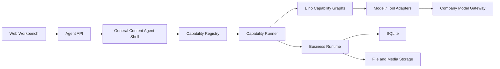

# 内容生产 Agent 阶段 2 架构基线

状态：阶段 2 工作基线  
版本：v0.2  
日期：2026-07-31

## 1. 文档目的

本文档承接已冻结的《阶段 1 产品定义》，回答三个问题：

1. 复制来的 Novel2Script 项目中，哪些能力可以直接复用；
2. 哪些实现目前与小说/非小说链路耦合，必须先抽象再接第三个 Skill；
3. 内容生产 Agent 第一版应采用什么目标架构和迁移顺序。

本文档不是最终 API、数据库和 JSON Schema。它先固定模块边界，避免后续在旧代码中继续堆叠 `if novel / non_novel / video`。

本项目有一条不可被后续实现改变的架构约束：

```text
General Content Agent Shell 是独立成立的通用 Agent。
小说转剧本、非小说转剧本和视频参考创作只是可选 Domain Capabilities。
没有挂载任何 Domain Capability 时，Agent 仍然存在并提供通用能力。
```

## 2. 审查范围

阶段 2 基线审查对象：

- `novel2script_agent_project/backend/internal/agent`
- `novel2script_agent_project/backend/internal/mainagent`
- `novel2script_agent_project/backend/internal/worker`
- `novel2script_agent_project/backend/cmd/server`
- `novel2script_agent_project/frontend/src`
- `novel2script_agent_project/design`
- `novel2script_agent_project/schemas`
- `novel2script_agent_project/docs`

当前技术基线：

```text
Go 1.22
React + TypeScript + Vite
Eino
SQLite
Lexical 剧本编辑器
SSE 运行事件
```

## 3. 当前架构事实

现有项目已经具备一个可运行的垂直流程型 Agent，不是通用 Content Agent Shell。

当前链路：

```text
React 工作台
-> Go HTTP API
-> Eino Main Agent Graph
-> 确定性业务 Guard
-> Go Runtime
-> Eino Content Worker Graph
-> 模型 Provider
-> SQLite
```

Eino 当前主要承担：

- Main Agent 的“模型判断 -> Guard”两节点图；
- Worker 的“输入校验 -> 模型调用 -> 输出校验”三节点图；
- 小说拆集和分集卡的批处理模型节点。

真正的业务流程顺序、审批、版本、下游影响、暂停恢复和任务 cursor 仍由 Go Runtime 管理。这个边界是正确的，应继续保留。

### 3.1 当前硬编码位置

当前不是通过 Capability Registry 加载流程，而是通过代码分支固定两条链：

```text
SourceModeNovel
SourceModeNonNovel
```

硬编码集中在：

- Runtime 的 Artifact 顺序、下一节点、审批策略和下游影响；
- Main Agent 的 Intent、来源模式和可执行动作；
- Worker 的 Prompt/Rules 路径、Artifact Schema 和上下文优先级；
- Server 的步骤映射、可编辑字段、依赖刷新和请求处理；
- 前端的 Artifact 联合类型、目录、标签、步骤文案和来源模式选择。

当前几个核心文件体量已经过大：

| 文件 | 约行数 | 风险 |
|---|---:|---|
| `backend/internal/agent/runtime/runtime.go` | 3,889 | 状态机、版本、批处理和领域流程混在一个文件 |
| `backend/cmd/server/main.go` | 2,972 | API、工作区、领域映射和执行动作耦合 |
| `backend/internal/mainagent/agent.go` | 1,689 | 意图识别和两条领域链路强耦合 |
| `backend/internal/worker/llmworker.go` | 1,356 | Prompt、Rules、Schema、上下文和解析混合 |
| `frontend/src/components/artifacts/ArtifactWorkspace.tsx` | 1,290 | 通用展示与领域字段编辑混合 |
| `frontend/src/App.tsx` | 1,179 | 工作台状态、项目、Run、消息和路由集中 |

如果直接加入视频链，会继续扩大这些中心文件，并使每个新 Skill 都需要修改整套系统。

### 3.2 行业架构对齐结论

当前主流 Agent 产品与框架的命名并不完全一致，但正在收敛到以下结构：

```text
Host Agent / Agent Runtime
+ Instructions and Context
+ Built-in or Generic Tools
+ Optional Skills / Domain Capabilities
+ MCP or External Tools
+ Guardrails and Human Approval
+ Sessions, Runs and Tracing
```

本项目采用该收敛结构，不照搬某一家 SDK 的类名：

- OpenAI Agents SDK 把 Agent 定义为配置了 instructions、tools、guardrails、handoffs 和 runtime behavior 的主体，Runner 管理运行循环、Tools 和 Sessions；
- Claude Code 由宿主 Agent 提供基础能力，Skills、Agents、Hooks 和 MCP 作为可发现、可按需加载的扩展；
- MCP 把外部能力拆为 Tools、Resources 和 Prompts，不负责替代宿主 Agent；
- 专业 Subagent 是可选执行模式，只适合需要独立上下文、自主多轮判断或隔离运行的复杂任务，不等于每一个业务 Skill。

官方参考：

- [OpenAI Agents SDK: Agents](https://openai.github.io/openai-agents-python/agents/)
- [OpenAI Agents SDK: Tools](https://openai.github.io/openai-agents-python/tools/)
- [OpenAI Agents SDK: Agent orchestration](https://openai.github.io/openai-agents-python/multi_agent/)
- [Claude Code: Extend Claude Code](https://code.claude.com/docs/en/features-overview)
- [Claude Code: Extend with skills](https://code.claude.com/docs/en/slash-commands)
- [Model Context Protocol: Architecture](https://modelcontextprotocol.io/docs/learn/architecture)

因此，本项目必须坚持：

1. Agent Shell 不依赖某个 Domain Capability 才能启动；
2. Domain Capability 是宿主 Agent 可发现和调用的业务流程；
3. Rule 是 Domain Capability 内按步骤加载的知识和约束，不是 Agent，也不是用户级 Capability；
4. Tool/Model/MCP 是执行资源，不等于完整业务流程；
5. Subagent 只在确有独立循环需求时使用，第一版三个 Skills 默认不各自复制成三个 Agent；
6. Runtime、Artifact 和 Approval 属于生产系统业务状态，不交给模型对话历史或 Skill 文件保存；
7. 用户始终与同一个 General Content Agent 交互，不因切换 Skill 而切换产品人格和工作区。

## 4. 复用结论

### 4.1 A 类：可直接复用

以下能力属于通用生产型 Agent 基础设施，第一版继续使用：

1. Go + Eino + SQLite 的总体技术栈；
2. Project、Message、Run、Artifact、Approval、Event 的基本概念；
3. Run 的运行、等待确认、暂停、恢复、失败、完成状态；
4. Artifact 的版本递增、`base_version` 冲突保护和旧版本保留；
5. 审批前不继续下游的业务 Guard；
6. 修改上游后“保留下游 / 重生成受影响下游”的交互语义；
7. 失败 cursor、服务重启恢复和 SSE + 快照兜底；
8. Main Agent 模型判断与确定性 Guard 分离；
9. Eino 只负责编排，不作为业务状态真源；
10. 选区快照、局部修改和最小上下文的基本机制；
11. `script_unit` 作为单集剧本编辑真源；
12. Lexical 剧本编辑器、单集编辑、保存和选区定位；
13. Project 级数据隔离和不同 Project 可并行的基本方向；
14. Prompt 与 Rules 分离、按步骤加载的设计方式；
15. 现有小说拆集、分集卡、逐集剧本的批处理经验。

### 4.2 B 类：抽象后复用

以下能力不能原样扩展，需要从两条链路中抽成通用协议：

| 当前实现 | 目标抽象 |
|---|---|
| `SourceMode` 决定整条流程 | `SkillID / CapabilityID` 决定流程，来源类型只是输入属性 |
| 固定 Intent 枚举 | 通用意图 + Capability 路由结果 |
| Runtime 内固定 Artifact 顺序 | Capability Definition 中声明步骤和转换 |
| 固定审批函数 | 每个 Step 声明审批策略 |
| 固定下游数组 | Artifact Dependency Graph |
| `Run.SourceMode` | `Run.CapabilityID`、`Run.CapabilityVersion` 和输入快照 |
| `Artifact.DerivedFrom []string` | 带 Artifact ID 和版本的强类型引用 |
| Project 固定 `source_mode` | Project 保存当前 Skill 状态，但不被一种来源模式永久绑定 |
| 固定 `GenerationConfig` | 通用 Run Config + Skill 专属配置 Schema |
| Worker 内 Prompt 路径 switch | Capability/Step Manifest 声明 Prompt 和 Rules |
| Worker 内 Artifact Schema switch | Artifact Schema Registry |
| 固定上下文优先级表 | Capability Context Policy |
| 前端固定 Artifact 联合类型 | 后端 Manifest + 前端 Capability UI Registry |
| 前端固定步骤和标签 | Capability 返回目录、状态和可用操作 |
| 文件 Base64 存 SQLite | 文件元数据与二进制存储分离 |

### 4.3 C 类：保留为领域 Skill

以下内容不应上移到 Agent Shell：

#### 小说转剧本

- `story_bible`
- `episode_split`
- 小说分集边界算法与校验
- 小说 `episode_cards`
- 小说 Prompt 和专用 Rules
- 不新增主线和关键设定的约束

#### 非小说文本转剧本

- `material_bank`
- `story_seed`
- `series_blueprint`
- 非小说 `episode_cards`
- 非小说素材补全与新增内容标记
- 非小说 Prompt 和专用 Rules

#### 两条文本链共享的剧本生产模块

- `script_context`
- `script_unit`
- `scripts` 聚合
- 单集连续性传递
- 剧本格式、对白和平台适配 Rules

该共享模块可以作为两个 Skill 共用的内部 package，但第一版不把它暴露为第四个用户 Skill。

### 4.4 D 类：第一版需要新增

#### 通用框架

- Capability Registry；
- Capability Runner；
- Artifact Schema Registry；
- Artifact Dependency Graph；
- Capability Context Pack；
- Capability UI Registry；
- 服务端模型网关 Adapter；
- 通用 Asset/File 对象和二进制存储；
- 项目级写 Run 互斥与全局并发控制；
- 候选剧本与唯一最终稿关系；
- 修订 Run 或等价的修订记录协议；
- 源文件删除影响检查；
- DOCX 导出；
- Skill 引用菜单和路由协议。

#### 视频参考创作

- 视频上传、原文件和处理副本分离；
- 视频时长、大小、格式和保留期限元数据；
- 文件名自然集号识别；
- 人工调整集号和顺序；
- 重复、缺集、无集号和失败检查；
- 单集视频解析任务和批量状态；
- `video_script_unit`；
- `reference_scripts` 聚合；
- `script_analysis`；
- 改编方案；
- `adaptation_brief`；
- 从已确认 Brief 进入非小说后续链；
- 原视频 7 天自动删除任务；
- 视频模型输入适配和压缩/转码策略。

## 5. 视频能力当前真实状态

复制项目中已经存在：

- `design/视频-prompts/step1_video_script_extract.md`
- `design/rules/video_to_script_extract/10_视频高还原剧本生成规则.md`

它们已经定义单集视频输入，以及旧 Prompt 包装中的 `plot_summary + script_unit` 高还原输出边界。阶段 2 的 Canonical Schema 已将其规范化为 `video_script_unit`。

但当前缺少：

- 视频文件上传和存储；
- 视频模型请求 Adapter；
- 把阶段 2 `video_script_unit` JSON Schema 接入 Runtime Validator；
- 视频单集任务；
- 视频批量 Run；
- 视频 Artifact；
- Runtime 流程注册；
- API；
- 前端状态和编辑入口；
- Prompt 输出的确定性校验；
- 整剧聚合、分析和 Brief。

因此当前结论是：

```text
视频提取的 Prompt/Rule 设计资产已存在；
可运行的视频 Skill 尚未存在。
```

## 6. 目标架构



### 6.1 Agent Shell

负责：

- 对话；
- 意图识别；
- 显式 Skill 引用解析；
- Capability 发现和路由；
- 当前作品、Run、审批和焦点上下文；
- 必要信息追问；
- Guard；
- 把确定动作交给 Runtime。

不负责：

- 定义小说拆集步骤；
- 定义视频解析批次；
- 保存业务状态；
- 自行决定跳过审批；
- 保存模型返回的未经验证结果。

#### 零 Domain Capability 时的能力基线

Agent Shell 的成立条件不能写成“至少注册一个 Skill”。即使 Domain Capability Registry 为空，Agent 仍必须能够：

1. 与用户进行自然语言对话和问答；
2. 理解当前消息的大致意图；
3. 在意图、对象或目标不明确时追问；
4. 维护当前作品、主对话、近期消息和焦点上下文；
5. 接收通用文本、文档、图片和视频 Asset；
6. 使用已启用的通用文件解析、图片理解或其他 Generic Tools；
7. 查看和解释当前作品中的通用材料与运行状态；
8. 判断完成请求是否需要 Domain Capability、Tool 或外部服务；
9. 发现并说明当前可用的 Domain Capabilities；
10. 缺少所需能力时明确说明缺少什么，不伪装成已经执行；
11. 管理通用的 Project、Conversation、Asset 和权限边界；
12. 在存在历史 Run 时查看状态、事件和已有 Artifact。

零 Domain Capability 时，Agent 不能：

- 凭普通聊天直接伪装成完整小说转剧本流程；
- 创建未注册类型的正式业务 Artifact；
- 绕过 Capability 的 Schema、审批和 Runtime；
- 因为模型“知道怎么写剧本”就声称已经运行剧本生产 Skill；
- 调用没有注册、没有权限或没有 Provider 的外部能力。

通用能力与 Domain Capability 的边界：

| 类型 | 示例 | 是否依赖 Domain Capability |
|---|---|---|
| Agent Core | 对话、意图理解、追问、能力发现、缺口说明 | 否 |
| Generic Runtime | Project、Conversation、Asset、Run 状态读取、Guard | 否 |
| Generic Tool | 文档解析、图片理解、文件元数据、未来 MCP 工具 | 否，但依赖对应 Tool 可用 |
| Domain Capability | 小说转剧本、非小说转剧本、视频参考创作 | 是 |
| Rule | 对白规则、拆集规则、视频高还原规则 | 只由相关 Capability 按需加载 |
| Subagent | 独立研究、独立审核、复杂规划执行器 | 可选，不是每个 Capability 的默认实现 |

### 6.2 Capability Registry

每个 Skill 注册一份可执行定义：

```json
{
  "$schema": "./manifest.schema.json",
  "id": "novel_to_script",
  "version": "1.0.0",
  "definition_status": "design_contract",
  "label": "小说转剧本",
  "description": "将小说原文转换为分集剧本",
  "kind": "domain_workflow",
  "entry_policy": {},
  "routing": {},
  "accepted_asset_kinds": ["text", "document"],
  "required_providers": ["content_model_provider", "document_parser"],
  "input_schema_ref": "../../schemas/v1/novel-to-script.schema.json#/$defs/input",
  "config_schema_refs": {
    "creation": "../../schemas/v1/novel-to-script.schema.json#/$defs/config"
  },
  "default_config_ref": "creation",
  "default_retry": {},
  "context_policy_ref": "context.novel_to_script.v1",
  "commands": [],
  "ui": {},
  "completion": {},
  "steps": []
}
```

上例只展示字段形状，完整必填值以 `../capabilities/v1/manifest.schema.json` 和三个源码 Manifest 为准。源码 Manifest 是唯一真源，启动时编译为只读 Go Definition；Artifact Types 和完整 Command/Approval 默认值由编译器展开，不维护第二份手写配置。

Registry 不允许由普通用户上传任意 Skill 代码。

这里的 Registry 更准确地说是 `Domain Capability Registry`。Agent Core 和通用工具不因为 Registry 为空而消失。

### 6.3 Capability Runner

负责：

- 根据 Capability Definition 创建 Run；
- 按步骤执行 Eino Graph；
- 保存 task cursor；
- 把输出交给 Schema Validator；
- 触发审批、暂停、恢复、重试和重新生成；
- 批量子任务调度；
- 把状态变化写入 Runtime。

Runner 不保存独立状态副本。Runtime 仍是业务事实唯一权威。

### 6.4 Business Runtime

负责：

- Project、Conversation、Run、Step；
- Artifact、ArtifactVersion、Dependency；
- Approval、Event；
- Asset 引用和删除影响；
- 候选剧本与最终稿；
- 并发互斥；
- 持久化和恢复；
- 生命周期和保留策略。

### 6.5 Eino

负责：

- Main Agent 判断图；
- Capability 内部步骤图；
- Worker 输入输出校验节点；
- 分支、批次和必要循环；
- 模型调用和 Tool 调用编排。

不负责：

- Project 数据；
- Artifact 版本真源；
- 最终稿选择；
- 文件保留期限；
- 业务审批记录；
- 下游失效事实。

### 6.6 Provider / Tool Adapter

第一版至少定义：

- `ControlModelProvider`
- `ContentModelProvider`
- `MultimodalVideoProvider`
- `DocumentParser`
- `ImageUnderstandingProvider`
- `MediaProcessor`
- `ExportProvider`

所有模型调用通过服务端公司内网透传。浏览器不持有 Key、URL 或模型凭据。

## 7. 第一版 Capability 图

### 7.1 `novel_to_script`

```text
source_input
-> story_bible
-> episode_split
-> episode_cards
-> script_context
-> script_unit[]
-> scripts
```

### 7.2 `non_novel_to_script`

```text
source_input
-> material_bank
-> story_seed
-> series_blueprint
-> episode_cards
-> script_context
-> script_unit[]
-> scripts
```

### 7.3 `video_reference_creation`

```text
video Asset Set Snapshot
-> video_script_unit[]
-> reference_scripts
-> script_analysis
-> adaptation_options
-> adaptation Decision Snapshot + creation Config Snapshot
-> adaptation_brief
-> story_seed
-> series_blueprint
-> episode_cards
-> script_context
-> script_unit[]
-> scripts
```

`video_reference_creation` 是一个用户 Skill。`script_analysis` 和 `adaptation_brief` 是 Skill 内部主要步骤，不拆成用户菜单里的独立 Skill。

### 7.4 合法转换

第一版只允许：

```text
video_reference_creation.adaptation_brief(confirmed)
-> non_novel shared downstream
```

不允许：

- 一个 Run 同时混合小说、非小说和视频三条输入；
- 多部参考剧自动融合；
- 从未确认分析或未确认 Brief 直接生成新剧本；
- 任意 Capability 互相跳转。

## 8. 核心对象调整方向

### 8.1 Project

建议保留：

- `project_id`
- `title`
- `status`
- `current_focus_artifact_id`
- `created_at`
- `updated_at`

需要新增或调整：

- 不再用单一 `source_mode` 永久定义作品；
- `active_write_run_id`；
- `current_capability_id`；
- `final_script_ref`；
- `workspace_visibility=shared_internal`；
- 最近工作台状态。

### 8.2 Conversation

当前消息直接挂 Project。阶段 2 应显式保留：

- `conversation_id`
- `project_id`
- `is_primary`
- 消息、附件引用和选择快照

第一版 UI 仍是一部作品一个连续主对话。

### 8.3 Run

建议结构方向：

```json
{
  "run_id": "",
  "project_id": "",
  "conversation_id": "",
  "capability_id": "",
  "capability_version": "",
  "run_kind": "generation | revision",
  "status": "",
  "current_step_id": "",
  "current_input_snapshot_version_id": "",
  "input_snapshot_status": "collecting | sealed",
  "config_snapshot": {},
  "task_cursor": {},
  "created_at": "",
  "updated_at": ""
}
```

来源类型保存在输入快照，不再承担 Capability ID 的职责。

### 8.4 Step

现有 Step 主要存在于事件和 `current_step_id` 中。阶段 2 需要显式 Step 实例：

```json
{
  "step_run_id": "",
  "run_id": "",
  "step_id": "",
  "status": "",
  "attempt": 1,
  "approval_policy": "none | checkpoint | batch_checkpoint",
  "task_cursor": {},
  "started_at": "",
  "ended_at": ""
}
```

批量步骤需要单独的子任务状态，但只在步骤级审批。

### 8.5 Artifact

建议把 Artifact 身份与版本明确分开：

```json
{
  "artifact_id": "logical artifact identity",
  "artifact_version_id": "immutable version identity",
  "artifact_type": "",
  "project_id": "",
  "run_id": "",
  "step_run_id": "",
  "capability_id": "",
  "version": 1,
  "status": "",
  "payload": {},
  "derived_from": [
    {
      "artifact_id": "",
      "artifact_version_id": "",
      "version": 1
    }
  ]
}
```

第一版可以继续使用一张表或 JSON payload 持久化，但 API 必须表达不可变版本引用，不能只记录字符串 ID。

### 8.6 Approval

需要记录审批时看到的精确版本：

```json
{
  "approval_request_id": "",
  "run_id": "",
  "step_run_id": "",
  "scope": "artifact | batch | transition | final_selection",
  "subject_refs": [],
  "input_version_snapshot": [],
  "options": [],
  "status": "pending | approved | rejected | cancelled"
}
```

产物修改后，旧 Approval 自动失效并创建新 Approval。

### 8.7 Asset

文件对象不能继续只围绕文本预览设计：

```json
{
  "asset_id": "",
  "project_id": "",
  "kind": "text | document | image | video",
  "display_name": "",
  "original_filename": "",
  "detected_mime_type": "",
  "size_bytes": 0,
  "checksum": "",
  "status": "available",
  "parse_status": "",
  "original_blob_id": "",
  "metadata": {
    "duration_ms": 0
  },
  "retention_policy_id": "",
  "expires_at": null,
  "deleted_at": null
}
```

集号和人工顺序由不可变 `Asset Set Version / Asset Set Member` 保存；物理 `storage_ref` 由 Asset Blob 保存。完整协议以 `asset-and-retention-contract.md` 为准。

原则：

- SQLite 保存元数据；
- 原文件保存在受控文件/对象存储；
- 不把几十 MB 视频 Base64 写入 SQLite；
- 派生产物通过 Asset ID 和版本追溯；
- 原文件到期删除后保留 tombstone 元数据。

### 8.8 Candidate Script 与 Final Script

作品允许多个候选剧本，但只能有一个当前最终稿：

```json
{
  "candidate_id": "",
  "project_id": "",
  "source_run_id": "",
  "source_capability_id": "",
  "scripts_artifact_version_id": "",
  "status": "candidate | final | historical_final"
}
```

改选最终稿必须创建确认记录，不覆盖历史关系。

## 9. Capability Context Pack

统一上下文包建议包含：

```json
{
  "project_context": {},
  "conversation_context": {},
  "run_context": {},
  "capability_context": {
    "capability_id": "",
    "step_id": "",
    "task_intent": ""
  },
  "target": {},
  "required_upstream": [],
  "focused_context": {},
  "selection_snapshot": {},
  "recent_events": [],
  "config_snapshot": {},
  "version_policy": {}
}
```

上下文选择由 Capability 声明，Runner 执行。不能继续在一个全局 `contextPriority` map 中硬编码所有 Artifact。

优先级：

```text
不可变用户选区
-> 明确目标 Artifact/子项
-> Capability 必需上游
-> 当前 Run 和审批
-> 近期相关事件
-> 作品摘要和近期对话
```

## 10. 前端架构方向

继续保留统一作品工作台，不为三个 Skills 各复制一套页面。

### 10.1 通用外壳

- 作品入口；
- 左侧流程和产物目录；
- 中间 Artifact/剧本工作区；
- 右侧 Agent；
- Run 状态、审批、暂停、恢复和错误；
- 文件上传和材料列表；
- 候选剧本与最终稿选择。

### 10.2 Capability UI Registry

前端根据后端 Manifest 和本地渲染器注册表决定：

- 当前 Skill 的目录；
- Artifact 标签；
- 专用编辑器；
- 批量子项列表；
- 可用操作；
- 审批卡；
- 当前步骤状态。

示例：

```ts
type CapabilityUIRegistration = {
  capabilityId: string;
  artifactRenderers: Record<string, ArtifactRenderer>;
  stepViews: Record<string, StepView>;
  labels: Record<string, string>;
};
```

未知 Artifact 使用通用结构化阅读器，但正式第一版 Artifact 应有明确中文标签和必要的专用交互。

### 10.3 第一版必须新增的前端状态

- Skill 菜单和引用 Token；
- 视频批量上传列表；
- 集号、顺序、重复和缺集状态；
- 单集解析进度和失败重试；
- 整体步骤统一确认；
- 剧本分析编辑；
- 改编方案选择；
- `adaptation_brief` 编辑与确认；
- 候选剧本列表和最终稿确认；
- 共享工作区提示；
- 源文件到期/已删除状态；
- DOCX 导出。

## 11. 数据持久化基线

当前项目把 Workspace 和 Runtime 分成两个 SQLite 数据库，并在 Runtime 表中大量存 JSON payload。第一版可以继续使用 SQLite，但需要：

1. 明确 Workspace DB 与 Runtime DB 的事务边界；
2. 禁止一个用户动作出现一边成功、一边失败却对外返回成功；
3. 为 schema migration 建立版本迁移和备份；
4. 文件二进制移出 SQLite；
5. 为 Project、Run、Step、Artifact、Approval、Dependency、Asset 建立可查询索引；
6. 保存 Capability ID 和版本；
7. 原视频删除任务必须幂等；
8. 服务重启后不得重复运行已成功的视频子任务；
9. 所有最终稿选择和修改保留审计事件。

第一版无登录不等于无并发风险。共享工作区中仍必须使用版本冲突保护和 Project 级写锁。

## 12. 迁移顺序

### M1：建立兼容层

- 在不改变现有小说/非小说行为的前提下增加 `capability_id`；
- 仅在旧 API Compatibility Adapter 接受 `source_mode`，立即映射为 `capability_id`；`/api/v1`、Project 和新 Runtime 不保留该正式字段；
- 为现有两条链建立 Capability Definition；
- 建立 Registry 和查询接口；
- 给现有测试增加 Capability 断言。

完成条件：旧两条链仍能运行，Runtime 不再通过 SourceMode 自己定义全部流程。

### M2：抽出通用流程协议

- Step Definition；
- Artifact Schema Registry；
- Approval Policy；
- Dependency Graph；
- Capability Context Policy；
- Runner；
- 前端 Capability UI Registry。

完成条件：增加一个最小测试 Capability 时，不需要修改 Runtime 核心分支和工作台主路由。

### M3：迁移现有文本 Skills

- 小说链注册为 `novel_to_script`；
- 非小说链注册为 `non_novel_to_script`；
- 共享剧本生成模块复用；
- 保留现有 Prompt、Rules、批处理和编辑能力；
- 回归现有 UAT 场景。

完成条件：两条旧链完成迁移且行为无回退。

### M4：补齐通用第一版能力

- Asset/File Store；
- Project 重命名；
- 删除影响确认；
- Skill 菜单；
- 活动 Run 与持续对话分离，冲突写操作由 Guard 阻止；
- 候选剧本和最终稿；
- DOCX 导出；
- 模型网关 Adapter；
- 配置化并发控制。

### M5：接入视频参考创作

- 视频上传和保留策略；
- 视频模型 Adapter；
- 单集解析；
- 批量排序和恢复；
- `reference_scripts`；
- `script_analysis`；
- 改编方案和 `adaptation_brief`；
- 接入非小说下游；
- 真实几十集样本验收。

## 13. 当前基线风险

### R1：领域硬编码扩散

如果先写视频 Runtime，再抽 Capability，第三条链会复制两条旧链的大量分支。必须先完成 M1 和 M2 的最小闭环。

### R2：中心文件过大

Runtime、Server、Main Agent、Worker 和前端 App 都已接近或超过单模块合理维护规模。迁移应按职责拆包，但不能一次推倒重写。

### R3：Prompt/Rule 路径编码

复制代码中的部分中文路径和界面文案出现乱码字符串。尤其 Prompt/Rules 的路径映射如果失真，会导致模型实际读取不到设计文件。进入实现前必须做 UTF-8 和真实路径校验，不能只依赖单元测试中的 mock。

### R4：设计资产不等于可运行能力

视频 Prompt/Rule 已存在，但没有执行、存储、校验和 UI。阶段汇报必须区分“设计完成”和“运行闭环完成”。

### R5：视频不适合 SQLite Base64

当前文件表包含 `content_base64`。该方式不能用于第一版几十集视频，需要二进制存储层和元数据引用。

### R6：双库一致性

Workspace DB 与 Runtime DB 分离。Project 活动 Run、消息、Artifact 和审批更新需要明确失败补偿和恢复规则。

### R7：上下文仍是全局硬编码

现有上下文裁剪已具备价值，但 Artifact 优先级和窗口策略直接写在 Worker 中。新增分析和 Brief 后会快速失控。

### R8：当前 UAT 遗留问题

旧项目已记录：

- 不完整故事开头可能被误判为小说；
- 剧本选区删除会因空文本被拒绝；
- 局部修改上下文偏大；
- 单集生成和非小说请求接近上下文预算上限。

这些问题不阻止架构抽象，但迁移回归必须保留为测试项。

## 14. 明确不做

阶段 2 不做：

- 推倒重写旧 Runtime；
- 同时引入 LangGraph、AutoGen 或 Claude SDK 作为第二主框架；
- 把业务状态迁入 Eino Checkpoint；
- 先复制三套 Agent 再做统一；
- 为未来所有 Skill 设计无限泛化插件系统；
- 在 Capability 协议稳定前实现视频正式链路；
- 在没有真实样本前增加 OCR/ASR 三模型交叉验证；
- 在无登录第一版提前建设复杂权限系统。

## 15. 阶段 2 后续交付物

本基线确认后，按以下顺序继续：

1. [已完成] `capability-registry-contract.md`
2. [已完成] `runtime-domain-model.md`
3. [已完成] `artifact-dependency-contract.md`
4. [已完成] `capability-context-pack-contract.md`
5. [已完成] `asset-and-retention-contract.md`
6. [已完成] `api-event-contract.md`
7. [已完成] `frontend-capability-ui-contract.md`
8. [已完成] 三个 Skills 的输入、配置、步骤和 Artifact Schema：`capability-workflow-schema-contract.md`、`../schemas/v1/`、`../capabilities/v1/`
9. [已完成] 数据迁移和兼容实施计划：`data-migration-compatibility-plan.md`
10. [已完成] 阶段 2 验收测试矩阵：`stage-2-acceptance-test-matrix.md`、`../acceptance/stage-2-matrix.json`
11. [已完成] 阶段 3 第 11 步前 P0 内容语义与质量审核补充合同：`content-semantics-and-quality-review-contract.md`

## 16. 阶段 2 完成门禁

阶段 2 只有满足以下条件才可以进入正式实现：

- Agent 在零 Domain Capability 状态下仍能完成已定义的通用交互和能力缺口说明；
- Domain Capability 不与 Agent Core、Generic Tool、Rule 或 Subagent 混用；
- 整体结构符合“Host Agent + optional capabilities/tools + runner + guardrails + persistent runtime”的行业收敛模式；
- Agent Shell、Capability、Runtime、Eino 和 Provider 边界无冲突；
- 三个 Skills 都能用同一套 Registry/Runner 协议表达；
- 小说和非小说现有能力有明确兼容迁移路径；
- 视频批量、分批上传、缺集、暂停恢复和 7 天删除有数据协议；
- Artifact 版本依赖和最终稿关系可追踪；
- API 和前端不再依赖固定两条 SourceMode 枚举；
- 所有主要 Artifact 有输入输出 Schema；
- 状态机和错误恢复可写成确定性验收用例；
- 没有要求模型承担业务状态真源；
- 没有把设计资产误报为已运行能力。

### 16.1 当前评审结论

截至 2026-07-31 重新校验：

- 阶段 2 的十项设计交付物已齐全；
- 96 项验收用例已覆盖 Agent Shell、三个 Skills、内容语义、质量审核、Runtime、Artifact/Context/Asset、API/SSE、前端、迁移、安全和非功能要求；
- 机器门禁已通过 JSON 解析、ID/Fixture 唯一性、枚举、文件引用、合同覆盖和人读版 ID 一致性校验；
- 三个 Capability 源码 Manifest 共 34 个 Step 均可达，Prompt、Rule、Schema、JSON Pointer 和 14 个 Response Adapter 引用均有效；
- 最终一致性检查已统一 Manifest 编译模型、真实 Step ID、Artifact Version 状态、分阶段 Config Snapshot、条件 Approval、视频 collecting/sealed 输入、无集号处理、Adaptation Decision Snapshot、API v1、UI 编译投影和旧兼容边界；
- 实现门禁和发布门禁尚未执行，不能表述为业务能力已运行。

阶段 2 当前状态为：**设计交付与一致性评审完成，等待产品负责人确认收口后进入正式实现。**
