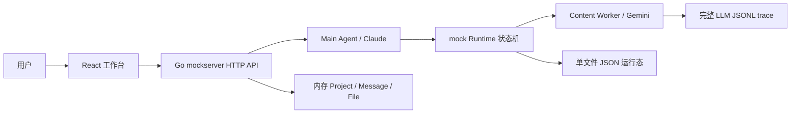

# Novel2Script Agent 0-1 全面审计

审计日期：2026-07-13  
审计范围：`novel2script_agent_project` 当前目录内的产品流程、视觉与交互、React 前端、Go 后端、API、运行态、Main Agent、内容 Worker、提示词与技能、测试、日志和历史包袱。  
审计性质：现状核验与整改排序，不代表本轮已经修复下列问题。

## 1. 结论先行

项目已经不是“只有设计稿的原型”。它具备真实可运行的 React 前端、Go API、Claude 主控、Gemini 内容生成、两条生成链、artifact 版本和局部修改能力，也已经跑通过真实短流程。

但它还不是可以放心交给真实长篇项目或长期保存项目数据的正式版本。当前最主要的风险不是页面样式，而是下面四类基础问题：

1. **数据可能丢失或相互覆盖**：项目、聊天和文件没有完整持久化；服务重启后项目编号还可能撞号；artifact 保存没有版本冲突保护。
2. **用户看到的剧本和 Agent 读取的剧本可能不是同一份**：正式剧本编辑器没有按 Lexical 合同实现，正文、场景结构、聚合剧本和单集产物之间可能分叉。
3. **长小说不可扩展**：内容 Worker 会把全部有效产物和原文反复塞进模型上下文，没有分层摘要、引用窗口或 token 预算。短文本验证通过不能证明长篇可用。
4. **当前仍是 mock runtime 承载真实生产逻辑**：Eino 尚未接入，HTTP、状态机、持久化和模型调用集中在少数超大文件中，后续每次改动都容易引发跨链路回归。

因此，当前全局项目阶段仍应认定为 **第 9 阶段：E2E 验证与缺陷修复**。在 P0 和核心 P1 完成以前，不建议进入正式发布、批量长篇测试或第 10 阶段性能优化。

## 2. 当前真实架构

关键事实：

- 前端：TypeScript、React 19、Vite；主工作台已完成三栏与窄屏区域切换。
- 后端：Go 1.22；入口和包仍叫 `mockserver` / `agent/mock`。
- 主控模型：Claude，负责意图和动作选择。
- 内容模型：Gemini，负责过程产物、剧本和 sparse patch。
- 持久化：run、event、artifact、approval 写入一个 JSON 文件；project、message、file 仅在内存。
- 正式编辑器：合同指定 Lexical，但实际用户界面仍使用原生 `contentEditable`。
- Eino：只有合同和计划，没有依赖、adapter 或 runtime 实现。

## 3. 已经成立的能力

以下能力不是纸面设计，当前实现和测试已经能证明：

- 闲聊不会误启动 run；附件上传本身不会启动 run。
- 明确生成意图会要求集数和单集时长。
- 小说与非小说两条主链可以生成到多集剧本。
- `field`、`entity`、`section`、单集、场景和句子等局部修改已有运行时路径。
- artifact 新版本会递增，旧版本会 superseded。
- `script_context` 已不再作为用户确认点。
- 下游已有内容时，修改上游会先询问“保留还是重生成”；确认重生成后才标记实际下游失效。
- rerun 已限制为失败 run 的失败 step，并保存 script task cursor。
- Go 单测和 `go vet` 当前通过；前端生产构建通过。

需要注意：这些结论只说明机制存在，不说明所有真实数据形态、并发、重启和长篇规模都已经安全。

## 4. P0：必须先修

P0 表示可能造成数据丢失、错误覆盖、用户看到与系统实际使用不一致，或使真实长篇项目无法完成。

### P0-1 项目编号在服务重启后可能撞号

- **位置**：`backend/cmd/mockserver/main.go` 的 `apiServer.counter`、`newProject`、`restoreProjectsFromRuntime`。
- **原因**：API 层 counter 不持久化。重启时按项目数重新增长，而不是从已有最大 ID 恢复；项目、消息和文件还共用同一个 counter。
- **影响**：新建项目可能拿到已经存在的 `project_000007`，覆盖内存中的旧项目壳，属于直接数据丢失风险。
- **修复要求**：统一持久化 ID 生成器，或改用 UUID/ULID；恢复时验证唯一性；项目、消息、文件分域生成 ID。

### P0-2 项目、完整聊天和上传文件没有持久化

- **位置**：`apiServer.projects/messages/files` 仅是内存 map；runtime state 只保存 run/event/artifact/approval。
- **影响**：后端重启后，未启动 run 的项目消失；完整聊天消失；上传文件正文消失。前端只能从 `run.metadata.user_message` 拼出一条用户消息和一条假的“已恢复”回复。
- **产品后果**：用户以为项目被保存，实际上只是部分运行产物被保存。
- **修复要求**：先定义正式 Store 接口，再用 SQLite 做本地单机持久化；Project、Message、File、Run、Artifact、Approval 需要事务关系和迁移版本。

### P0-3 运行中的任务重启后不会恢复

- **位置**：runtime 异步任务均使用 `go ... context.Background()`；`loadState` 只修复 approval，不修复 `running` job。
- **影响**：后端在模型生成中重启后，JSON 里仍是 running，但执行协程已经消失；前端会永久轮询一个不会结束的 run。
- **修复要求**：持久化 job/task cursor；启动时把孤立 running 状态转为可恢复失败或重新入队；模型调用要有可取消 job context。

### P0-4 剧本编辑存在“用户看到一份、Agent 使用另一份”的分叉

- **位置**：`frontend/src/components/artifacts/ScriptWorkbench.tsx`。
- **原因**：保存只改 `script_text` 和 `editor_html`，不更新 `scenes[].blocks/lines`；编辑聚合 `scripts.script_units[index]` 时，也不会同步独立 `script_unit` artifact。
- **影响**：页面显示已改，但后续局部修改、连续性检查或下游生成仍可能读取旧场景结构或旧单集。
- **修复要求**：确定唯一业务真源。建议以结构化 `script_document` 为真源，`script_text` 只作派生导出；聚合 scripts 也只作派生视图，不允许独立修改出另一份数据。

### P0-5 Agent 新版本可能被前端旧编辑缓存遮住并覆盖

- **位置**：`ScriptWorkbench` 的 `episodeHTML` 初始化只在 episode ID 不存在时写入。
- **原因**：artifact 已升版本，但 episode ID 不变，前端继续保留旧 HTML。
- **影响**：Agent 明明改成功，用户仍看到旧文本；再次点击保存会把旧文本写成更高版本，反向覆盖 Agent 结果。
- **修复要求**：编辑缓存键至少包含 artifact ID + version；版本变化时做 dirty/conflict 合并，而不是静默复用旧 HTML。

### P0-6 artifact 保存没有并发版本保护

**状态：已于 2026-07-13 修复。**

- **位置**：`PATCH /api/artifacts/{artifact_id}` 只接收 `payload`。
- **合同差异**：`shared-schema-contract.md` 和 `api-event-contract.md` 明确要求 `base_version`，冲突返回 409。
- **影响**：旧浏览器页、两个标签页或慢请求可以覆盖较新的 Agent/人工版本。
- **修复要求**：请求提交 `base_version`；后端在同一事务内比较当前版本；不一致返回 `CONFLICT` 并提供当前版本摘要。
- **实施结果**：过程产物和分集剧本两个保存入口均提交 `base_version`；runtime 在锁内校验当前版本。旧 artifact ID、已失效版本或版本号不一致均返回 HTTP 409，并携带当前 artifact；冲突请求不写 payload、不创建新版本、不追加事件。
- **用户反馈**：前端加载冲突响应中的最新版本，并显示“旧版修改未保存”的工作区提示，禁止静默覆盖。
- **验证**：runtime 单元测试、API 测试、Go 全量测试、前端生产构建、桌面与 390px 浏览器回归均通过。

### P0-7 长小说上下文会快速膨胀

- **位置**：`backend/internal/worker/llmworker.go` 的 `artifactDigest`、`PlanStep`、`WriteScriptStep`。
- **原因**：digest 实际包含每个有效 artifact 的完整 payload。每一集剧本请求还带完整原文、全部过程产物和已有剧本。
- **证据**：当前 trace 单次请求已达到约 110,056 字符，而 live 样本仍远小于真实长篇小说。
- **影响**：token 超限、成本和延迟增长、模型忽略局部指令、跨集串线，最终导致长篇项目不可完成。
- **修复要求**：建立 Context Assembler：固定 token 预算、artifact 摘要层、按 episode 的 source refs、相邻集窗口、角色/连续性状态、必要原文片段按需检索。

### P0-8 完整原文、提示词和模型输出长期明文落盘

- **位置**：`backend/internal/llm/client.go` 的 `writeTrace`。
- **证据**：`runs/llm_trace.jsonl` 约 8.7 MB、191 条，记录完整 request messages 和 response；文件权限为普通本地文件权限。
- **影响**：小说原文、用户创意、人物设定和全部剧本都被复制进 trace；后续分享项目目录或备份时极易泄露。
- **修复要求**：trace 默认关闭或分级；正式日志只保留 request ID、模型、token、耗时、状态和脱敏摘要；完整 I/O 仅在显式 debug 开关下短期保存并设置清理策略。

## 5. P1：核心流程可靠性

### P1-1 正式剧本编辑器没有实现 Lexical 合同

- 生产界面使用原生 `contentEditable`、`innerHTML` 和已废弃的 `document.execCommand`。
- Lexical 只存在于 spike；Tiptap、Lexical 和 CodeMirror 依赖同时留在包中。
- 稳定节点 ID、Lexical state、selection hash、批注、建议接受/拒绝、可靠撤销栈均未进入生产。
- 这是架构缺口，不是换几个按钮样式可以解决。

### P1-2 剧本格式保存后可能消失

- 保存会写 `editor_html`，但读取 episode 时主要从 scenes 或 `script_text` 重建 HTML，没有把 `editor_html` 当作可靠恢复源。
- 用户的加粗、斜体、下划线等富文本格式可能在刷新后丢失。

### P1-3 剧本没有未保存状态和离开保护

- 过程产物编辑器已有 dirty guard；ScriptWorkbench 没有接入同一套状态。
- 切换集数只保存在 React 内存，刷新、关闭页面、切换视图可能无提示丢失。
- 保存按钮也没有基于 diff 的启用状态。

### P1-4 剧本选区定位不可靠

- 通过 `plain.indexOf(selectedText)` 查找第一个同文句；重复台词会定位错。
- 未找到时被 `Math.max(0, -1)` 改成 0，错误地指向开头。
- DOM 的 closest 可能只拿到 line ID，拿不到 scene ID。
- 应由 Lexical selection 和稳定节点 ID 生成，不应从 DOM 文本反推。

### P1-5 手动编辑器不支持结构安全编辑

- 通用 artifact 编辑器一次渲染全部嵌套字段；当前故事圣经编辑态约 137 个输入控件。
- 空数组没有“新增一项”，已有数组也缺少明确的新增、删除、排序和 schema 约束。
- 用户能改文本，但不能可靠地维护复杂结构。

### P1-6 模型输出没有真正的 schema 校验

- `parseSingleArtifact` 只校验 JSON、artifact_type 和 payload 非空。
- `normalizeArtifactPayload` 只做一层解包，不校验必填字段、字段类型、枚举和 ID 唯一性。
- 当前 schema 是提示词字符串，不是可执行校验器。
- 模型返回缺字段或错误类型时仍可能入库，问题会延迟到下一节点或前端才暴露。

### P1-7 持久化失败被静默吞掉

- `saveLocked()` 不返回 error，marshal、mkdir、write、rename 失败都直接 return。
- API 仍可能向前端返回“成功”，health 仍固定 ok。
- 需要原子写错误上抛、磁盘健康检查、备份和损坏恢复。

### P1-8 approval 失败响应会把确认入口从前端拿掉

- `resolveApproval` 出错时仍返回 HTTP 200，并返回 `approval_request: nil`。
- runtime 可能仍在等待确认，但前端会清空确认卡，用户失去恢复入口。
- 应返回结构化失败，并保留当前 approval 与可重试动作。

### P1-9 业务失败大量伪装成 HTTP 200

- 启动生成、确认、重跑、修改失败时，handler 常把动作改成 reply 并返回 200。
- 用户看到自然语言错误，但客户端无法稳定区分“聊天成功”和“工作流失败”。
- 应统一错误码、`error.code`、`retryable`、run 状态和恢复动作。

### P1-10 替换输入材料后的回复与真实状态不一致

- 回复称“旧版及其下游产物已标记为过期”。
- 新逻辑实际只保存上游新版本，并创建“保留/重生成下游”的待确认状态。
- 这会让用户误以为后续内容已被删除或失效。

### P1-11 运行中的模型请求不能真正暂停或取消

- pause 只对 waiting_approval/paused 有效。
- 后台模型调用使用 `context.Background()`，用户点击暂停无法中断正在生成的请求。
- 应有 run/job cancel context，并明确“停止后保留已完成任务”。

### P1-12 Main Agent 决策存在多套权威来源

- 主控模型先判断；`normalizeDecision` 和 `guardDecision` 再用大量规则改写；服务端还有小说证据启发式；前端又持有 source mode 和配置判断。
- 保护规则本身必要，但同一语义散落在模型 prompt、Go 规则和前端逻辑中，容易出现“Claude 原回复”和“前端最终展示/执行”不同。
- 应输出可审计的 `model_decision`、`guarded_decision`、`executed_action`，用户文案只由最终动作生成一次。

### P1-13 source mode 可能被三方冲突覆盖

- 用户提示、主控模型判断、`hasStrongNovelSourceEvidence` 都能决定 source mode。
- 服务器启发式可强行覆盖模型为 novel；前端还保留当前 mode。
- 应定义单一优先级和冲突时的解释，不要静默覆盖。

### P1-14 前端更新后的二次刷新失败被吞掉

- `applyArtifactUpdate` 在 PATCH 后再拉 snapshot，但 `.catch(() => undefined)`。
- artifact 可能保存成功，而 approval、run、下游影响状态没有同步；界面仍表现为成功。
- 应显示“内容已保存，但状态同步失败”，并提供重试。

### P1-15 项目 API 与 UI 的产品模型不一致

- 后端有项目列表 API，但前端启动后自动选择最近项目，没有项目列表、切换或明确的新建入口。
- 用户实际上使用的是“隐式单项目工作台”，却承担多项目 ID 和恢复复杂度。
- 要么先做真正项目管理，要么明确 MVP 只允许一个工作区，避免半套多项目。

### P1-16 前端没有使用已经实现的 SSE

- 后端有 `/events/stream`，合同也要求断线后按 event ID 补拉。
- 前端对 running run 每 1.2 秒拉完整 snapshot，SSE 客户端未落地。
- 产物增大后会反复传输完整 artifacts，增加延迟和内存压力。

### P1-17 HTTP 服务缺少正式边界

- 使用 `http.ListenAndServe`，没有 read header、read、write、idle timeout。
- 请求体没有 `MaxBytesReader`；前端的 5 MB 限制不能保护后端。
- CORS 为 `*`，允许方法列表还漏了实际使用的 PATCH。
- 本地单机阶段可接受无登录，但必须限制 127.0.0.1、请求大小和允许来源，部署前必须加认证。

### P1-18 未知项目 ID 会被自动创建

- `ensureProject` 对任意传入 project ID 都能生成项目壳。
- 拼写错误或过期前端会静默创建新项目，掩盖数据问题。
- 正式项目消息和上传应对不存在项目返回 404；只有创建接口能创建项目。

### P1-19 运行时存在两套新旧执行路径

- 同时保留同步 `StartRunContext/ContinueRunContext` 与异步 stepwise 路径。
- 旧测试或新调用很容易走不同状态机，修一套漏一套。
- 应收敛为一个 runtime contract，旧路径迁入 archive 或删除。

### P1-20 Eino 尚未接入

- `go.mod` 无 Eino 依赖；没有 Eino adapter、graph 或 runtime 切换。
- 当前真实模型调用仍由 `internal/agent/mock` 编排。
- 这不妨碍继续修 P0，但不能把当前状态描述为“正式 Agent Runtime 已完成”。

## 6. P2：可用性、可维护性和质量

### P2-1 三栏在完成态空间失衡

- 桌面 1440 宽时，左目录和右 Agent 各占固定区域，但完成态下方大面积空白；中央长文档反而被限制。
- 建议让侧栏可折叠、记忆宽度；完成态默认缩窄 Agent，等待确认时再提升存在感。

### P2-2 长产物缺少高效阅读定位

- 当前故事圣经阅读卡约 4,336 px 高。
- 折叠首三段比以前好，但仍缺少段落目录、仅看有内容、跳到最近修改、搜索和差异高亮。

### P2-3 编辑态信息负担过大

- 故事圣经编辑态一次出现约 137 个输入控件；字段标签横向滚动提示较弱。
- 应按 artifact 设计专用编辑器，至少分为“常用字段、结构列表、来源证据、风险与追踪”。

### P2-4 通用字段映射仍是手工大表

- 中文可读性已经改善，但未知字段仍依赖 fallback，可能出现中英混合或“补充信息”。
- 字段定义、排序、中文名、控件类型应来自共享 schema/manifest，而不是组件内手工维护。

### P2-5 页面缺少生产级错误边界

- 历史 dev log 曾因一个未定义函数使整个 ArtifactPayloadView 崩溃，并触发 React 的 ErrorBoundary 提示。
- 当前错误已修，但主应用仍没有分区 ErrorBoundary。
- 单个产物渲染失败不应拖垮整个工作台。

### P2-6 可访问性语义不完整

- “artifact view” 声明为 tablist，但内部按钮没有统一 `role=tab`/`aria-selected`。
- B/I/U/S 的可访问名称只是字母，不是“加粗/斜体/下划线/删除线”。
- 分集当前项缺少 `aria-current` 或 tab 语义；需要完整键盘和焦点回归。

### P2-7 前端核心文件过大

- `App.tsx` 约 849 行，`ArtifactWorkspace.tsx` 约 992 行，`styles.css` 超过 2,300 行。
- 状态恢复、轮询、导航保护、聊天、approval 和 artifact 合并集中在 App，修改一个交互容易影响全局。
- 应按 project session、run stream、artifact editor、agent conversation 拆 hook/store 和边界组件。

### P2-8 后端核心文件过大

- `cmd/mockserver/main.go` 约 1,973 行，runtime 超过 2,900 行，Main Agent 和 Worker 各约 900 行。
- HTTP、DTO、项目存储、上下文组装、启发式识别和错误文案混在入口文件。
- 应拆 handler/service/store/context assembler/runtime reducer/LLM gateway。

### P2-9 API 客户端不可配置且无取消机制

- API base 写死为 `http://127.0.0.1:8831`。
- fetch 没有 timeout、AbortController、request ID 和重试策略，并默认所有请求都按 JSON 处理。
- 应改环境配置，并区分读请求重试和写请求幂等。

### P2-10 模型重试和退避不足

- LLM client 有 180 秒 timeout，但没有统一的指数退避、429/5xx 重试预算、幂等 task key。
- 模型失败会直接把 run 置失败；用户只能手动 rerun。

### P2-11 前端没有正式单元/组件测试

- package scripts 只有 build 和 editor gate。
- 没有 Vitest/React Testing Library，也没有状态恢复、artifact merge、dirty guard、approval 和选择定位的自动化测试。
- 当前很多前端关键逻辑只能靠人工浏览器回归。

### P2-12 编辑器 gate 不是生产编辑器 gate

- gate 指向 Lexical spike，而真实工作台是 contentEditable。
- 本机本轮运行还因 Chromium `spawn EPERM` 无法启动。
- 即使 gate 通过，也不能证明生产 ScriptWorkbench 安全。

### P2-13 Go 覆盖率工具链不完整

- 普通 `go test ./...` 通过，`go vet ./...` 通过。
- `go test -cover ./...` 因当前内置 Go 工具缺少 `covdata` 失败，无法给出覆盖率基线。

### P2-14 运行态单文件会持续膨胀

- 当前 runtime JSON 约 1.37 MB，仅 10 个 run、44 个 approval。
- 每次状态变化都 marshal 整个文件并 rename；规模增大后会造成写放大和阻塞。
- 应由 SQLite/事件表替代，至少先做压缩归档和大小监控。

### P2-15 事件展示依赖英文消息字符串

- 事件类型已有结构，但部分前端标签仍依赖固定英文 message 转换。
- 未知事件会泄露内部英文；文案调整还可能破坏 UI 映射。
- 前端应只依赖 event type、step ID 和结构化 metadata。

### P2-16 Agent 完成态回复信息价值偏低

- 恢复后固定显示“已恢复上次项目状态”，没有说明项目名、run 状态、最新版本、最近修改和待办。
- 完成态 Agent 面板大面积空白，缺少最近变更摘要和可执行建议。

### P2-17 生成配置权威值分散

- 请求、Main Agent decision、run metadata、artifact payload 都可能携带 generation_config。
- runtime 有 authoritative 合并逻辑，但前端和模型上下文仍可能读到不同层级。
- 应在 Project/Run 层建立单一权威配置版本，artifact 只记录引用版本。

### P2-18 局部修改测试“机制覆盖较好，真实 schema 覆盖不足”

- 已有矩阵测试覆盖 planning artifact 的 field/entity/section、script span/scene、上下游保留和重生成。
- 但测试多使用小型手工 payload；没有对每份正式 schema 的所有数组主键、空数组、重复名称、缺 ID、深层嵌套和非法模型输出做数据驱动验证。
- 所以不能表述为“每个 artifact 的所有修改方式全部验完”。

## 7. P3：历史包袱与清理项

### P3-1 README 已严重过期

- README 仍描述 Python 原型、未来接模型和“源代码为空/待实现”，与当前 Go/React/真实模型不符。
- 还有重复段落，容易让新维护者走错入口。

### P3-2 Python 原型仍留在正式源码根

- `src/novel2script_agent`、`pyproject.toml`、tests 仍描述未配置 LLM 的旧 runner。
- 其 artifact 命名和状态枚举与 Go 正式实现也不一致。
- 应明确 archive，或作为独立设计校验工具改名；不要继续让它看起来像主后端。

### P3-3 Git 仓库不可用

- `.git` 目录存在但为空/不可识别，当前目录无法使用 git history、diff、blame 和可靠回滚。
- 这是长期维护和审计的基础风险。

### P3-4 生成物和依赖污染工作区

- `frontend/node_modules` 约 156 MB，`frontend/dist` 在目录内，后端还留有约 30 MB 测试 exe。
- `.gitignore` 没有覆盖 node_modules、dist、`*.exe`、tsbuildinfo 等。

### P3-5 编辑器依赖和 spike 未清理

- Tiptap、Lexical、CodeMirror 同时在依赖中；App 仍可通过 query 参数进入 spike。
- 生产 bundle 约 495 KB，构建还有 Lexical pure annotation 警告。
- 选定正式 Lexical 后应删除停用依赖和生产入口中的 spike。

### P3-6 设计文档缺少明确的现行/过期标记

- `design/` 有 50 余份根级文档，部分写“尚未进入正式开发”，部分记录新实现。
- 同一主题存在初版、审计、handoff、refresh 和 plan，多份文档都像 source of truth。
- 应建立 `design/INDEX.md`，标记 authoritative / supporting / archived、版本日期和替代关系。

### P3-7 命名仍停留在 mock

- 入口 `cmd/mockserver`、运行态 `agent/mock`、状态文件 `mock_runtime_state.json`，但已经调用真实模型并承载真实数据。
- 命名会误导运维、测试和后续 Eino 迁移边界。

### P3-8 缺少标准工程入口

- 没有 CI、Docker、Taskfile/Makefile、数据库迁移、统一 lint/format/test 命令和正式发布配置。
- 当前启动依赖本机 `.tools`、PowerShell 脚本和既有环境。

## 8. 视觉与交互证据

### 已完成剧本工作台

观察：三栏结构清楚，剧本是主内容；但完成态 Agent 与目录区域留白明显，中央编辑空间偏窄。

### 故事圣经阅读态

观察：字段中文化和分组已经可读，但真实文档高度超过四千像素，需要目录、搜索、最近变更和差异定位。

### 故事圣经编辑态

观察：编辑区域宽度问题已改善，但一次展示 137 个控件，仍是“把 JSON 变成表单”，还不是面向编剧工作流的专用编辑体验。

### 窄屏内容区

观察：768 px 下没有横向溢出，目录/内容/Agent 区域切换有效；但长文档定位和待确认提醒高度依赖顶部切换。

## 9. 原五项缺陷的当前复核

| 原问题 | 当前判断 | 说明 |
|---|---|---|
| 刷新后无法恢复项目/run/artifact/聊天 | **部分修复** | run/artifact/approval 可恢复；项目壳从 run 重建；完整聊天、文件、无 run 项目仍丢失 |
| 新产物仍显示 v1 | **已修机制** | runtime 测试覆盖版本递增；仍缺并发 base_version |
| script_context 暴露确认卡 | **已修** | 当前不要求 approval；仍保留为内部 artifact |
| 未知字段显示“补充信息/编号” | **部分修复** | 映射和阅读结构明显改善；仍是手工字段表，未知 schema 仍会 fallback |
| rerun 可重跑未失败步骤 | **已修核心逻辑** | 只允许 failed run 的 failed step；script task cursor 有测试 |

## 10. 修改与刷新逻辑的当前判断

### 明确修改与追问

- 现有 Main Agent 测试已覆盖“明确修改直接执行”“疑问句不执行”“模糊修改先澄清”。
- 但模型决策后还有多层规则改写，真实回复与执行动作仍需用 `model_decision -> guarded_decision -> executed_action` trace 做透明核验。

### 局部修改粒度

- 过程 artifact：field/entity/section 的 sparse patch 机制已存在，并有共性矩阵测试。
- 分集卡：可按 episode 缩小下游影响范围。
- 剧本：span/scene 有专用 patch 结构，单集任务有 episode cursor。
- 未完成点：真实 schema 级验证不足；生产剧本编辑器缺稳定节点和 selection hash；手动编辑会破坏结构同步。

### 下游刷新

- 没有下游：修改当前 artifact 后不额外询问，后续自然读取新版本，逻辑正确。
- 已有下游：先保留现有内容并询问；用户选择重生成后才把实际存在的下游标记 stale/invalidated，方向正确。
- 未完成点：回复文案、approval 同步失败路径、source replace 特例仍不一致；长链重生成缺少可取消 job 与恢复。

## 11. 推荐整改顺序

### 第一批：数据安全底座

1. 修复 ID 碰撞。
2. 引入 SQLite Store，持久化 Project/Message/File/Run/Artifact/Approval/Task。
3. 增加 artifact `base_version` 和 409 冲突处理。
4. 重启时恢复/失败化孤立 running task。
5. 关闭默认完整 LLM trace，补脱敏与清理策略。

这批必须前后端一起改，且需要数据迁移和 API 回归。

### 第二批：剧本唯一真源

1. 正式接入 Lexical，不再使用 `execCommand`。
2. 定义 `script_document` 结构与文本导出器。
3. 消除 scripts 聚合与 script_unit 的双写；聚合只读派生。
4. 接入 dirty guard、selection hash、版本冲突和新版本刷新。
5. 为人工编辑与 Agent patch 做同一套 reducer 测试。

这批是前后端共同改造，不能只在前端修显示。

### 第三批：Agent 与长篇上下文

1. 建立统一 Context Assembler 和 token budget。
2. 为每个 episode 保存 source refs、上游摘要、连续性快照。
3. Main Agent 记录模型原决策、规则修正和最终动作。
4. schema 改为可执行校验；模型输出失败时不入库。
5. 将 job cancellation、retry、cursor recovery 做成 runtime 能力。

### 第四批：架构收敛与 Eino

1. 拆分 HTTP、service、store、runtime reducer、context assembler、LLM gateway。
2. 删除同步旧 runtime 路径，保留一个正式 Runtime 接口。
3. 在接口稳定后接 Eino graph；不要让 Eino 直接写 HTTP 或存储。
4. 把 `mockserver` 更名为正式 server，mock 只留测试 adapter。

### 第五批：产品体验与工程化

1. 做项目列表/切换，或明确单项目 MVP。
2. 做 artifact 专用阅读与编辑器、搜索、差异和最近修改定位。
3. 接 SSE，减少全量轮询。
4. 增加前端组件测试、正式编辑器 E2E、CI 和统一命令。
5. 清理 README、Python 原型、依赖、二进制和过期设计文档。

## 12. 验收门槛

完成第 9 阶段至少需要满足：

- 服务重启后项目、聊天、文件、run、artifact、approval、task 全部一致恢复。
- 两个浏览器同时编辑同一 artifact 时，旧版本保存会得到明确冲突，不会覆盖。
- Agent 修改后，编辑器立即显示新版本；有未保存内容时明确提示合并/放弃。
- 剧本文本、结构节点、单集 artifact 和聚合视图不存在双写分叉。
- 真实长篇样本按 token 预算分批生成，任何单次请求都不携带全量历史。
- 模型输出经过 schema 校验，非法数据不会入库。
- P0/P1 关键路径有 API 测试、前端组件测试和浏览器 E2E。
- 默认日志不包含完整原文和完整模型输出。

## 13. 本轮验证记录

- 后端存活：`127.0.0.1:8831`。
- 前端存活：`127.0.0.1:8832`。
- `go test ./...`：通过。
- `go vet ./...`：通过。
- `npm run build`：通过；JS 约 495 KB，存在 Lexical 构建注释警告。
- `npm run gate:editor`：未执行成功，Chromium 启动被系统以 EPERM 拒绝；且该 gate 只覆盖 spike。
- Python pytest：环境没有 pytest；旧 Python 原型本身也不是当前主链。
- Go coverage：当前 Go 工具链缺少 `covdata`，无法形成覆盖率报告。
- 当前浏览器页面：无新增 console error；窄屏 768 px 无横向溢出。

## 14. 最终判断

项目的产品方向和主链已经成立，最近几轮针对版本、局部修改、下游确认、内部 artifact 和失败重跑的修复也确实有效。但项目正在用“原型时期的存储、编辑器和 runtime 结构”承载“真实模型与真实项目数据”，这是当前所有高优先级问题的共同根源。

正确路线不是继续逐个补 UI 现象，而是先完成数据安全和剧本唯一真源，再做长篇上下文和 Runtime 收敛。完成这些后，Eino 接入才会是替换编排层，而不是把现有耦合整体搬进另一个框架。
